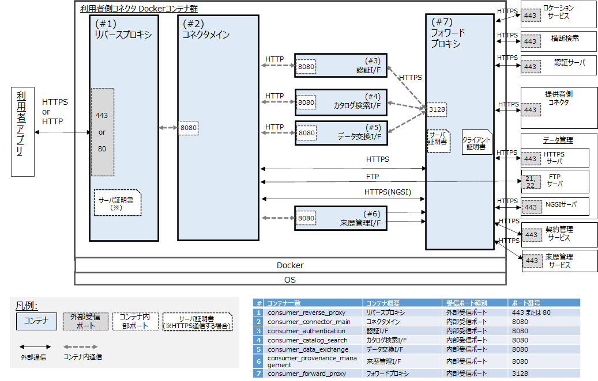

# データ利用者環境の構築

<!-- omit in toc -->
## 目次

- [1. 前提](#1-前提)
  - [1.1. CADDEテストベッド参加のための事前準備](#11-caddeテストベッド参加のための事前準備)
  - [1.2. 実行環境](#12-実行環境)
- [2. インストール](#2-インストール)
  - [2.1. 利用者コネクタ環境準備](#21-利用者コネクタ環境準備)
    - [2.1.1. 利用者コネクタ取得](#211-利用者コネクタ取得)
    - [2.1.2. 共通ファイルの展開](#212-共通ファイルの展開)
    - [2.1.3. リバースプロキシの設定](#213-リバースプロキシの設定)
    - [2.1.4. フォワードプロキシの設定](#214-フォワードプロキシの設定)
    - [2.1.5. データカタログの接続設定](#215-データカタログの接続設定)
    - [2.1.6. 認証機能の接続設定](#216-認証機能の接続設定)
    - [2.1.7. 提供者コネクタの接続設定](#217-提供者コネクタの接続設定)
    - [2.1.8. 来歴管理の接続設定](#218-来歴管理の接続設定)
    - [2.1.9. その他カスタマイズ可能な項目](#219-その他カスタマイズ可能な項目)
    - [2.1.10. 利用者コネクタの起動](#2110-利用者コネクタの起動)
    - [2.1.11. （参考）利用者コネクタの停止](#2111-参考利用者コネクタの停止)
  - [2.2. 利用者WebApp環境準備](#22-利用者webapp環境準備)
    - [2.2.1. 利用者WebApp取得](#221-利用者webapp取得)
    - [2.2.2. 環境変数の設定](#222-環境変数の設定)
    - [2.2.3. その他カスタマイズ可能な項目](#223-その他カスタマイズ可能な項目)
    - [2.2.4. 利用者WebAppの起動](#224-利用者webappの起動)
    - [2.2.5. （参考）利用者WebAppの停止](#225-参考利用者webappの停止)

## 1. 前提

### 1.1. CADDEテストベッド参加のための事前準備

CADDEテストベッドの利用開始にあたって、テストベッド参加者は[CADDEテストベッド参加のための事前準備](./README.md#caddeテストベッド参加のための事前準備)を行う必要がある。

以降のデータ提供者環境の構築にあたっては、以下の作業が完了していることを前提とする。

- [CADDEテストベッド利用情報の取得](./README.md#caddeテストベッド利用情報の取得)
- [CADDEテストベッド参加者環境のドメイン登録](./README.md#caddeテストベッド参加者環境のドメイン登録)
- [CADDEテストベッド用TLS証明書の取得](./README.md#caddeテストベッド用tls証明書の取得)

### 1.2. 実行環境

データ利用者環境を構築するマシンは以下の条件を満たすことを前提とする。

- OS：Linux
- CPU：2コア
- メモリ：4GB
- ディスク：20GB

また、以下のコマンドおよびソフトウェアが利用可能であることを前提とする。

- Docker（v20.10.1 以上）
- Git
- curl
- jq
- OpenSSL（v1.1.1 以上）

## 2. インストール

データ利用者環境では、以下2つのアプリケーションを構築する。

- 利用者コネクタ
- 利用者WebApp

はじめに、以降の作業用ディレクトリを作成し、環境変数`${WORKDIR}`で参照することとする。

```bash
mkdir ~/cadde_testbed
cd ~/cadde_testbed
export WORKDIR=$PWD
```

### 2.1. 利用者コネクタ環境準備

#### 2.1.1. 利用者コネクタ取得

GitHubからCADDEコネクタリポジトリをクローンする。

```bash
cd ${WORKDIR}
git clone https://github.com/Koshizuka-lab/klab-connector-v4.git
cd klab-connector-v4
git switch testbed
```

ブランチが`testbed`であることを確認する。

```bash
$ git branch
  main
* testbed
```

`klab-connector-v4/src/consumer`に利用者コネクタ用ソースコードが配置してある。

#### 2.1.2. 共通ファイルの展開

`setup.sh`を実行する。

```bash
cd ${WORKDIR}/klab-connector-v4/src/consumer
sh setup.sh
```

#### 2.1.3. リバースプロキシの設定

利用者コネクタに対する通信はHTTPSによる接続が推奨される。

そこで、CADDEテストベッド用TLS証明書をリバースプロキシに配置するための設定を行う。

##### 秘密鍵・サーバ証明書の準備

[CADDEテストベッド参加のための事前準備](#11-caddeテストベッド参加のための事前準備)で取得した秘密鍵・TLS証明書を配置するためのディレクトリを作成する。

このディレクトリはリバースプロキシ用Dockerコンテナにマウントされる。

```bash
mkdir -p ${WORKDIR}/klab-connector-v4/src/consumer/nginx/volumes/ssl
```

作成したディレクトリに秘密鍵とTLS証明書のファイルをそれぞれ配置する。
配置する際のファイル名は以下の通り。

- 秘密鍵：**`server.key`**
- TLS証明書：**`server.crt`**

ディレクトリが以下の状態になれば完了である。

```bash
$ ls ${WORKDIR}/klab-connector-v4/src/consumer/nginx/volumes/ssl
server.crt  server.key
```

#### 2.1.4. フォワードプロキシの設定

CADDEはデータ共有の信頼性を高めるため、利用者コネクタ - 提供者コネクタ間の相互TLS通信をサポートしている。

ここでは、提供者コネクタに提示するクライアント証明書、および提供者コネクタに対するインタフェースとなるフォワードプロキシの準備を行う。

##### 秘密鍵・クライアント証明書の準備

証明書の準備作業を簡単にするため、クライアント証明書にはサーバ証明書に用いたものと同じCADDEテストベッド用TLS証明書を用いる。

[CADDEテストベッド参加のための事前準備](#11-caddeテストベッド参加のための事前準備)で取得した秘密鍵・TLS証明書を配置するためのディレクトリを作成する。

このディレクトリはフォワードプロキシ用Dockerコンテナにマウントされる。

```bash
mkdir -p ${WORKDIR}/klab-connector-v4/src/consumer/squid/volumes/ssl
```

作成したディレクトリに秘密鍵とTLS証明書のファイルをそれぞれ配置する。
配置する際のファイル名は以下の通り。

- 秘密鍵：**`client.key`**
- TLS証明書：**`client.crt`**

さらに、秘密鍵ファイルをフォワードプロキシ用コンテナの内部から読み取りできるよう、ファイルのアクセス権限を変更しておく。

```bash
chmod +r ${WORKDIR}/klab-connector-v4/src/consumer/squid/volumes/ssl/client.key
```

ディレクトリが以下の状態になれば完了である。

```bash
$ ls -l ${WORKDIR}/klab-connector-v4/src/consumer/squid/volumes/ssl
total 20
-rw-r--r-- 1 ubuntu ubuntu 6200 Aug  7 02:56 client.crt
-rw-r--r-- 1 ubuntu ubuntu 3272 Aug  7 02:56 client.key
```

##### SSL Bump用自己署名SSL証明書を作成

フォワードプロキシは利用者コネクタ - 提供者コネクタ間のTLSセッションを中継する機能を持つ。
これをSSL Bumpという。

CADDEの実装では、利用者コネクタが提供者コネクタにアクセスするたび、SSL Bumpを利用することでフォワードプロキシがクライアント証明書を提示するようにする。

このとき、利用者コネクタ本体は一時的にフォワードプロキシとの間にTLSセッションを張るため、フォワードプロキシにTLS証明書を配置する必要がある。
そこで、フォワードプロキシに自己署名TLS証明書を配置し、プロキシがその証明書を基に動的にサーバ証明書を生成するようにしている。

以下のコマンドによりフォワードプロキシ上にSSL Bump用自己署名TLS証明書`squidCA.pem`を作成する。

```bash
cd ${WORKDIR}/klab-connector-v4/src/consumer/squid/volumes/ssl
openssl req -new -newkey rsa:4096 -days 365 -nodes -x509 -keyout squidCA.pem -out squidCA.pem -subj "/C="
```

さらに、フォワードプロキシ用自己署名証明書についても、コンテナ内のユーザから読み取りできるようにファイルのアクセス権限を変更しておく。

```bash
chmod +r ${WORKDIR}/klab-connector-v4/src/consumer/squid/volumes/ssl/squidCA.pem
```

ディレクトリが以下の状態になれば完了である。

```bash
$ ls -l ${WORKDIR}/klab-connector-v4/src/consumer/squid/volumes/ssl
total 20
-rw-r--r-- 1 ubuntu ubuntu 6200 Aug  7 02:56 client.crt
-rw-r--r-- 1 ubuntu ubuntu 3272 Aug  7 02:56 client.key
-rw-r--r-- 1 ubuntu ubuntu 5021 Aug  7 03:01 squidCA.pem
```

##### フォワードプロキシの初期セットアップ

利用者コネクタ全体を起動する前に、フォワードプロキシ用コンテナを一度起動させ、SSL Bumpの初期設定を行う。

まず、以下のコマンドを実行してフォワードプロキシを起動する。

```bash
cd ${WORKDIR}/klab-connector-v4/src/consumer/squid
docker compose -f docker-compose_initial.yml up -d --build
```

以下のコマンドでフォワードプロキシが起動しているか確認する。

```bash
docker compose -f docker-compose_initial.yml ps
```

次に、以下のコマンドを実行してSSL Bumpで用いられるデータベースを初期化する。

```bash
$ docker exec -it forward-proxy /usr/lib/squid/security_file_certgen -c -s /var/lib/squid/ssl_db -M 20MB
Initialization SSL db...
Done
```

そして、フォワードプロキシ用コンテナ内部のディレクトリをホストにコピーする。
プロキシコンテナ内の`var/lib/squid/ssl_db`ディレクトリをホスト上の`src/consumer/squid/volumes`以下にコピーする。

```bash
docker cp forward-proxy:/var/lib/squid/ssl_db ./volumes/
```

以上でフォワードプロキシの初期設定は完了であるため、コンテナを終了させる。

```bash
docker compose -f docker-compose_initial.yml down
```

#### 2.1.5. データカタログの接続設定

横断検索カタログから取得したいデータを検索するため、横断検索機能APIのURLを以下のファイルに設定する。

- `klab-connector-v4/src/consumer/catalog-search/swagger_server/configs/public_ckan.json`

ただし、横断検索機能に関する情報はCADDEテストベッド参加者で共通であるため、デフォルトの記載のまま変更しなくともよい。

以下の設定項目が存在する。

- **`public_ckan_url`**
  - 横断検索機能APIのURL

以下にデフォルトの設定例を示す。

```json
{
    "public_ckan_url": "https://cadde-federated-catalog.koshizukalab.dataspace.internal:20443/backend/api/package_search"
}
```

#### 2.1.6. 認証機能の接続設定

認証機能との接続には、認証機能によって割り当てられた利用者コネクタの情報が必要である。
この情報を以下のファイルに設定する。

- `klab-connector-v4/src/consumer/connector-main/swagger_server/configs/connector.json`

設定すべき項目は以下の通り。

- **`consumer_connector_id`**
  - 利用者コネクタのクライアントID（認証機能から発行）
- **`consumer_connector_secret`**
  - 利用者コネクタのクライアントシークレット（認証機能から発行）
- **`location_service_url`**
  - ロケーションサービスのアクセスURL
  - ロケーションサービスを利用しない場合、空文字`''`を設定する
- **`trace_log_enable`**
  - コネクタの詳細ログ出力有無
  - デフォルト：`true`

CADDEテストベッドはロケーションサービスを含まないため、`location_service_url`の項目は空文字のままとしておく。

以下に設定例を示す。

```json
{
    "consumer_connector_id" : "consumer-test2",
    "consumer_connector_secret" : "XXX",
    "location_service_url" : "",
    "trace_log_enable" : true 
}
```

#### 2.1.7. 提供者コネクタの接続設定

データ提供者のCADDEユーザIDと提供者コネクタのロケーションを紐づける設定を以下のファイルで行う。

- `klab-connector-v4/src/consumer/connector-main/swagger_server/configs/location.json`

なお、ロケーションサービスを利用することで自動的に提供者コネクタのロケーションを解決することも可能であるが、CADDEテストベッドはロケーションサービスを含まないため、手動で提供者コネクタのロケーションを追記していく。

設定すべき項目は以下の通り。

- **`connector_location`**
  - フォーマット：`"<データ提供者ID>": { "provider_connector_url": "<提供者コネクタURL>" }`
  - 接続先となる提供者コネクタの数だけ追記する

以下に設定例を示す。

```json
{
    "connector_location": {
        "test1": {
            "provider_connector_url": "https://cadde-provider-test1.koshizukalab.dataspace.internal:443"
        },
        "handson-site0X": {
            "provider_connector_url": "https://cadde-provider-handson.site0X.dataspace.internal:443"
        }
    }
}
```

#### 2.1.8. 来歴管理の接続設定

来歴管理機能を利用する場合、来歴管理サーバURLを以下のファイルに設定する。

- `klab-connector-v4/src/consumer/provenance-management/swagger_server/configs/provenance.json`

ただし、来歴管理機能に関する情報はCADDEテストベッド参加者で共通であるため、デフォルトの記載のまま変更しなくともよい。

以下の設定項目が存在する。

- **`provenance_management_api_url`**
  - 来歴管理機能APIのベースURL

以下にデフォルトの設定例を示す。

```json
{
    "provenance_management_api_url": "http://cadde-provenance-management.koshizukalab.dataspace.internal:3000/v2"
}
```

#### 2.1.9. その他カスタマイズ可能な項目

##### 利用者コネクタのポート番号

`docker-compose.yml`を編集することで、利用者コネクタを起動する際のポート番号を変更することができる。

以下の例では利用者コネクタをホストマシンの80, 443番で立ち上げ、コンテナの80, 443番ポートにそれぞれフォワーディングしている。

```yaml:docker-compose.yml
...
services:
  consumer-reverse-proxy:
    ports:
      - 443:443
      - 80:80
```

#### 2.1.10. 利用者コネクタの起動

以下のコマンドを実行し、利用者コネクタ用のDockerコンテナ群を起動する。

```bash
cd ${WORKDIR}/klab-connector-v4/src/consumer
sh start.sh
```

利用者コネクタの起動状況は以下のコマンドで確認できる。
7つのコンテナすべてが立ち上がっていれば、利用者コネクタの起動は完了である。

```bash
cd ${WORKDIR}/klab-connector-v4/src/consumer
docker compose ps
```



#### 2.1.11. （参考）利用者コネクタの停止

利用者コネクタを停止したい場合は、以下のコマンドを実行する。

```bash
cd ${WORKDIR}/klab-connector-v4/src/consumer
sh ./stop.sh
```

### 2.2. 利用者WebApp環境準備

#### 2.2.1. 利用者WebApp取得

GitHubからCADDE利用者WebAppのリポジトリをクローンする。

```bash
cd ${WORKDIR}
git clone https://github.com/Koshizuka-lab/ut-cadde_gui.git
cd ut-cadde_gui
git switch testbed
```

ブランチが`testbed`であることを確認する。

```bash
$ git branch
  main
* testbed
```

#### 2.2.2. 環境変数の設定

利用者WebAppを利用するには、認証機能から割り当てられたWebAppのクライアント情報が必要となる。
そこで、WebAppのクライアント情報を環境変数に設定する。

ここでは`.env.local`ファイルを編集し、アプリケーションコード内で環境変数を読み込ませる。<br/>
まず、`.env`ファイルをコピーして`.env.local`ファイルを作成する。

```bash
cd ${WORKDIR}/ut-cadde_gui
cp .env .env.local
```

`.env.local`ファイル内に記載すべき項目は以下の通り。

- **`AUTH_API_URL`**
  - 認証機能CADDE APIベースURL
  - デフォルト：`https://cadde-authn.koshizukalab.dataspace.internal:18443/cadde/api/v4/`
- **`CLIENT_ID`**
  - 利用者WebAppのクライアントID
- **`CLIENT_SECRET`**
  - 利用者WebAppのクライアントシークレット

#### 2.2.3. その他カスタマイズ可能な項目

##### 利用者WebAppのポート番号

`docker-compose.yml`を編集することで、利用者WebAppを起動する際のポート番号を変更することができる。

以下の例では利用者WebAppをホストマシンの3000番で立ち上げ、コンテナの3000番ポートにフォワーディングしている。

```yaml:docker-compose.yml
...
services:
  app:
    ports:
      - "3000:3000"
```

#### 2.2.4. 利用者WebAppの起動

以下のコマンドを実行し、利用者WebApp用のDockerコンテナを起動する。
デフォルトでは3000番ポートで起動される。

```bash
cd ${WORKDIR}/ut-cadde_gui
docker compose build
docker compose up -d
```

利用者WebAppの起動状況は以下のコマンドで確認できる。

```bash
cd ${WORKDIR}/ut-cadde_gui
docker compose ps
```

利用者WebAppを構築したURLにアクセスし、以下の画面が表示された上で、CADDEユーザIDとパスワードでユーザ認証に成功すれば準備は完了である。


#### 2.2.5. （参考）利用者WebAppの停止

利用者WebAppを停止したい場合は、以下のコマンドを実行する。

```bash
cd ${WORKDIR}/ut-cadde_gui
docker compose down
```
