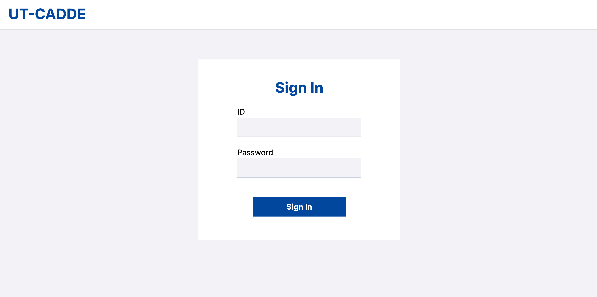
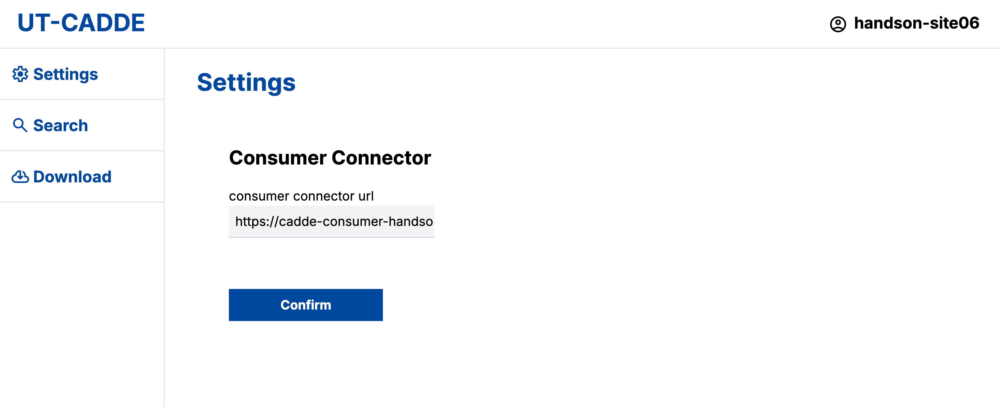
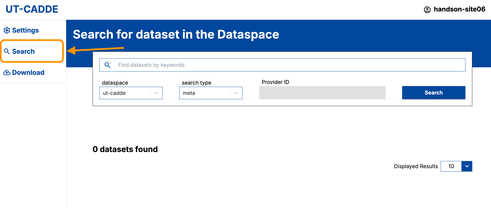
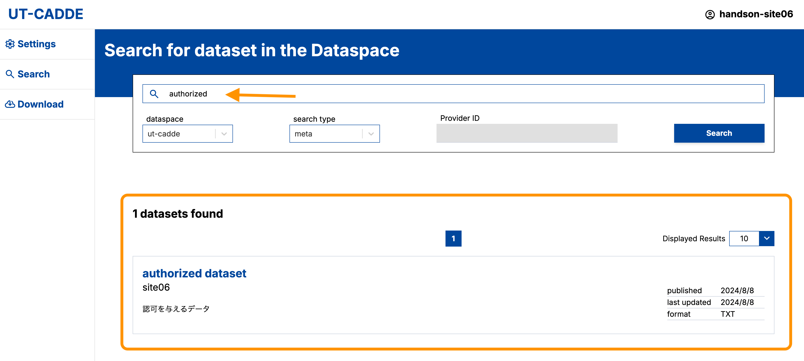
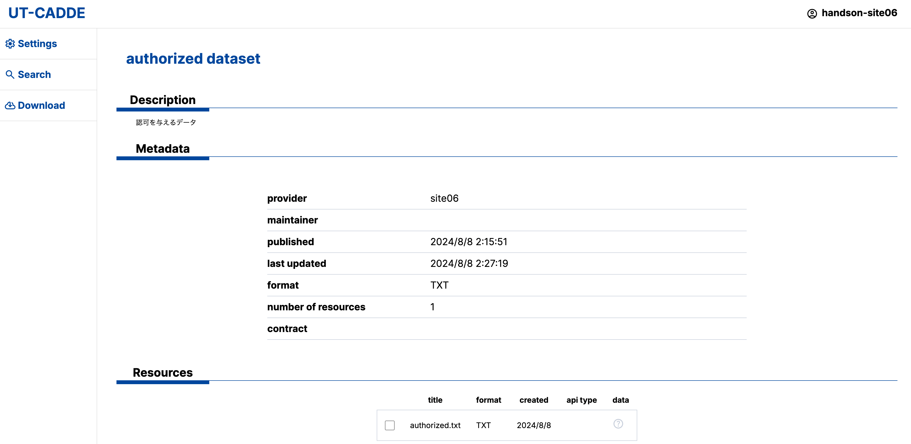
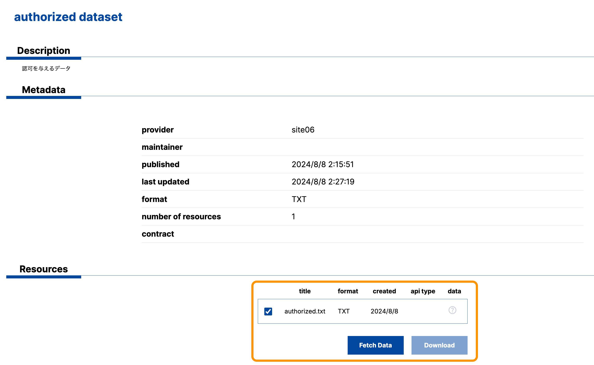
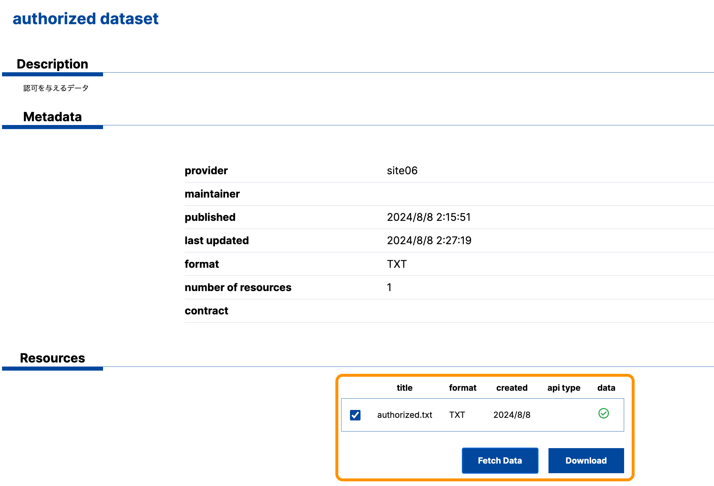
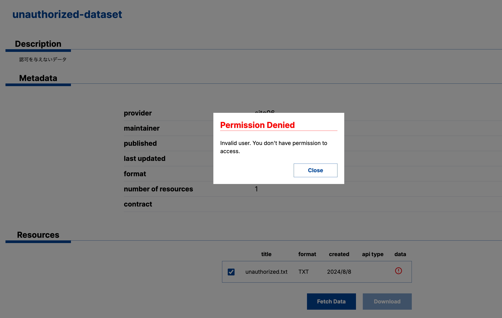

# CADDEテストベッド データ共有ハンズオン

<!-- omit in toc -->

## 0. 前提

　[データ共有環境の構築(高速版)](https://github.com/Prismoid/klab-connector-v4/blob/main/doc_testbed/high-speed-data-share-setup.md)を完了させている。


## 1. CADDEでデータを提供する


### 1.1. データカタログの作成

　以下は提供者カタログサイト(https://cadde-catalog-0001.<サイト名>.dataspace.internal:8433)にアクセスし、設定を行う。

### 1.1.1 CKANサイトでアカウントを作成し、`CKAN_API_KEY`を取得する。
　[CKANの初期設定](https://github.com/Koshizuka-lab/klab-connector-v4/blob/data-share-handson/doc_testbed/provider.md#212-ckanの初期設定)を参考にアカウントを作成する。

管理者アカウントは以下で設定されている。
```
管理者アカウント -> ckan_admin
パスワード -> test1234
```
作成するユーザは

最後に`CKAN_API_KEY`を取得したら、以下のディレクトリのファイル`ckan_api_key.env`に記述しておく。
```

```


### 1.1.2 データカタログの作成

　[データカタログの作成](https://github.com/Koshizuka-lab/klab-connector-v4/blob/data-share-handson/doc_testbed/provider.md#32-データカタログの作成)を参考にする。

最初の画面の設定項目は以下の


変更及び設定が必要な項目は以下であることに注意する。
 - `Title`、`Visibility`、2種類の`Custom Field` (最初の画面)
 - `URL`、`Name` (次の画面)

作成した後の画面で、「Data and Resources」下のファイル名をクリックする。
Additional Informationの下のShow moreをクリックし、IDを手元に控えておく。
(このIDは、原本情報登録で使用する)

### 1.2. 提供者認可サーバにて、認可設定する

先述の通り、本ハンズオンではデータ利用者に対して「認可を与えるデータ」「認可を与えないデータ」の2種類を提供する。

したがって、HTTPサーバに配置した2種類のデータの認可設定を行う。

2種類のデータそれぞれについて、設定する認可の条件は以下の通り。

- 認可を与えるデータ
  - リソースURL
    - 「認可を与えるデータ」のURL
    - 例：`http://data-management.<sitename>.internal:8080/authorized.txt`
  - ユーザに対する認可
    - 自分のハンズオン用CADDEユーザIDを指定する
- 認可を与えないデータ
  - リソースURL
    - 「認可を与えないデータ」のURL
    - 例：`http://data-management.<sitename>.internal:8080/unauthorized.txt`
  - ユーザに対する認可
    - 自分のハンズオン用CADDEユーザID以外の適当な文字列を指定する

認可を設定するための詳細な手順は[provider.md](./provider.md#33-認可の設定)を参照する。

### 1.3. データ原本情報を登録する(来歴管理サーバと、提供者カタログサイトへの登録)

環境変数`data-reg-config.env`にCKAN_API_KEYと

```
bash 
```

---

#### 3.5. 提供者コネクタとデータサーバを接続する

HTTPサーバに配置した2種類のデータのロケーションを提供者コネクタに設定する。

詳細な手順は[provider.md](./provider.md#34-データサーバの接続設定)を参照する。

データ提供者環境のホストにログインした上で、以下のファイルを編集する。

- `klab-connector-v4/src/provider/connector-main/swagger_server/configs/http.json`

このとき、設定するデータのURLは、データ原本情報の登録・データカタログの作成の際と同じく、HTTPサーバに割り当てた独自ドメインを使って記述することに注意する。

以下に設定例を示す。
データURLは各自の環境に応じて適宜設定する。

```json
{
    "basic_auth": [],
    "authorization": [
        {
            "url": "http://data-management.siteXX.internal:8080/authorized.txt",
            "enable": true
        },
        {
            "url": "http://data-management.siteXX.internal:8080/unauthorized.txt",
            "enable": true
        }
    ],
    "contract_management_service": [
        {
            "url": "http://data-management.siteXX.internal:8080/authorized.txt",
            "enable": false
        },
        {
            "url": "http://data-management.siteXX.internal:8080/unauthorized.txt",
            "enable": false
        }
    ],
    "register_provenance": [
        {
            "url": "http://data-management.siteXX.internal:8080/authorized.txt",
            "enable": true
        },
        {
            "url": "http://data-management.siteXX.internal:8080/unauthorized.txt",
            "enable": true
        }
    ]
}
```

---

### 4. CADDEでデータを取得する

本章では、データ利用者が利用者WebApp・利用者コネクタを介して、CADDEからデータを取得する手順を実践する。

#### 4.1. ユーザ認証

利用者WebAppトップページからハンズオン用のCADDEユーザID・パスワードを入力してログインする。



このとき、背後では利用者WebAppが認証機能にリクエストを行なってCADDE利用者トークンを取得している。
CADDE利用者トークンはCADDEユーザに関する情報を含んでおり、後述する詳細検索やデータ取得における認可判断に利用される。

#### 4.2. 利用者コネクタの接続設定

ログインに成功すると次の画面に遷移する。

ここでWebAppが接続先とする利用者コネクタURLを指定し、`Confirm`を押す。

- 例：`https://cadde-consumer-handson.siteXX.dataspace.internal:443/`



#### 4.3. 横断検索によってデータを発見する

利用者WebApp画面左側のメニューから`Search`を選択し、データ検索画面に遷移する。



画面上部の検索窓に、作成したデータカタログのタイトルやデータURLなどの情報を一部入力して検索する。

ここで`search_type`の欄の`meta`という値が、データカタログの横断検索リクエストを行うことを示している。<br/>
このとき、背後では利用者WebAppが横断検索機能にリクエストを行ない、クローリングされたデータカタログの一覧を取得している。

検索結果が表示され、データカタログページに遷移して情報を確認することができれば完了である。

以下に画面例を示す。




<!-- ####  4.3. 詳細検索によってデータカタログを取得する -->
<!-- ここでは

利用者WebApp画面左側のメニューから`Search`を選択し、次のデータ検索画面に遷移する。


画面上部の検索窓に[作成したデータカタログ](#33-データカタログを作成する)のタイトルやデータURLなどの情報を一部入力して検索する。

ここで`search_type`の欄の`meta`という値が、データカタログの横断検索リクエストを行うことを示している。
このとき、背後では利用者WebAppが横断検索機能にリクエストを行なってクローリングされたデータカタログの一覧を取得している。

検索結果が表示され、データカタログページに遷移して情報を確認することができれば完了である。

以下に画面例を示す。


 -->

#### 4.4. データ提供者からデータを取得する

##### 認可ありのデータ

データ検索結果から、「認可ありのデータ」のデータセットページに遷移し、取得したいリソースにチェックを入れる。



この状態で`Fetch Data`を押すと、背後で利用者WebAppが提供者コネクタに対してデータ取得リクエストを送信する。

データ提供者環境でデータアクセスが認可されれば、実際にデータが転送される。
その結果、取得できたリソースに緑色のチェックマークが表示される。



この状態で`Download`を押せば、ブラウザにデータがダウンロードされ、CADDEを通じたデータ転送が完了する。

##### 認可なしのデータ

「認可なしのデータ」に対して、`Fetch Data`を押してデータ取得リクエストを送信すると、以下のエラーメッセージが表示される。



これは、データ提供者環境で、当該データに対するアクセスが認可されていないことを示すものである。

---

### 5. CADDE上のデータの来歴を確認する

最後に、CADDE上で共有されたデータの来歴確認（データ交換・加工の履歴）を実践する。
ここでは、認可を与えるデータ、認可を与えないデータそれぞれに対して来歴を確認する。

データの来歴を確認するためには、来歴管理機能の来歴確認APIを利用する。<br/>
来歴管理機能APIの詳細な仕様は、[CADDE来歴管理システム設計書](https://github.com/CADDE-sip/documents/tree/cd02836c046054d9661f9963d3801cc9fd230631/doc/2/50_V4_%E3%83%A6%E3%83%BC%E3%82%B9%E3%82%B1%E3%83%BC%E3%82%B9%E5%9F%BA%E6%9C%AC%E8%A8%AD%E8%A8%88%E6%9B%B8/70_V4_%E8%A8%AD%E8%A8%88%E6%9B%B8_%E6%9D%A5%E6%AD%B4%E7%AE%A1%E7%90%86%E3%82%B7%E3%82%B9%E3%83%86%E3%83%A0%E8%A8%AD%E8%A8%88%E6%9B%B8)を参照すること。

来歴確認APIの実行例は以下の通り。

パスパラメータにデータの原本情報を登録した際に得られるイベントIDを指定する。

```bash
curl -v -sS "http://cadde-provenance-management.koshizukalab.dataspace.internal:3000/v2/lineage/<原本情報登録イベントID>?direction=BOTH&depth=-1" \
| jq '.'
```

APIの実行に成功すると、認可を与えるデータについては以下のような3つのJSONオブジェクトが入ったリストが返される。

```json
[
  {
    "cdldatamodelversion": "2.0",
    "cdldatatags": [
      {
        "cdlsha256hash": "c38653b18b0f815ba7d5d08f86a66aa8d2a3250e9f2c858b57cbeff6b5201264",
        "cdluri": "http://data-management.site06.internal:8080/authorized.txt"
      }
    ],
    "cdleventid": "f16e3276-8726-4a12-a537-1befef69d9ca",
    "cdleventtype": "Create",
    "cdlnextevents": [
      "e7db1c00-cbd6-44a4-86b2-0926965b3909"
    ],
    "cdlorganization": "org01.cdl.com",
    "cdlpreviousevents": [],
    "cdltimestamp": "2024-08-07T19:29:38.949Z",
    "dataprovider": "handson-site06"
  },
  {
    "cdldatamodelversion": "2.0",
    "cdleventid": "e7db1c00-cbd6-44a4-86b2-0926965b3909",
    "cdleventtype": "Sent",
    "cdlnextevents": [
      "91d25340-f184-447d-9793-207fa65b90e2"
    ],
    "cdlorganization": "org01.cdl.com",
    "cdlpreviousevents": [
      "f16e3276-8726-4a12-a537-1befef69d9ca"
    ],
    "cdltimestamp": "2024-08-08T03:10:01.792Z",
    "dataprovider": "handson-site06",
    "datauser": "handson-site06"
  },
  {
    "cdldatamodelversion": "2.0",
    "cdleventid": "91d25340-f184-447d-9793-207fa65b90e2",
    "cdleventtype": "Received",
    "cdlnextevents": [],
    "cdlorganization": "org01.cdl.com",
    "cdlpreviousevents": [
      "e7db1c00-cbd6-44a4-86b2-0926965b3909"
    ],
    "cdltimestamp": "2024-08-08T03:10:03.909Z",
    "dataprovider": "handson-site06",
    "datauser": "handson-site06"
  }
]
```

各JSONオブジェクトは来歴管理上の1つのイベントに対応し、主に次のような情報を持つ。

- **`cdleventid`**
  - イベントの識別子
- **`cdleventtype`**
  - イベント種別
  - `Create`
    - データ原本情報の登録
    - データ提供準備時に作成
  - `Sent`
    - データ送信履歴
    - データ取得リクエストが認可された場合に提供者コネクタが自動で作成
  - `Received`
    - データ受信履歴
    - データ取得リクエストが成功した場合に利用者コネクタが自動で作成
- **`cdlnextevents`**
  - 当該イベント直後のイベントID
- **`cdlpreviousevents`**
  - 当該イベント直前のイベントID
- **`cdltimestamp`**
  - 当該イベント発生時の日時
- **`dataprovider`**
  - データ提供者のCADDEユーザID
- **`datauser`**
  - データ利用者のCADDEユーザID

一方、認可を与えないデータについては、データの送信および受信が実行されていないため、以下のようにデータ原本情報の登録イベントだけが格納されたリストが返される。

```json
[
  {
    "cdldatamodelversion": "2.0",
    "cdldatatags": [
      {
        "cdlsha256hash": "daa99d24e9df77ebc8756a34b61bb34cb621951f37b489c30bc448ad28eb5ba8",
        "cdluri": "http://data-management.site06.internal:8080/unauthorized.txt"
      }
    ],
    "cdleventid": "3d7bbfcf-3764-4937-b106-f1b14fa01416",
    "cdleventtype": "Create",
    "cdlnextevents": [],
    "cdlorganization": "org01.cdl.com",
    "cdlpreviousevents": [],
    "cdltimestamp": "2024-08-07T19:37:02.613Z",
    "dataprovider": "handson-site06"
  }
]
```
