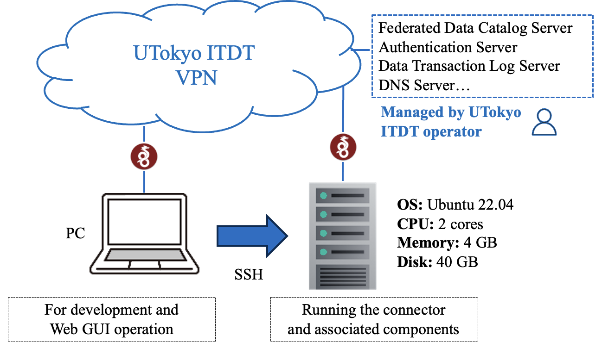

# データ共有環境の構築(通常版)

<!-- omit in toc -->

## 0.前提

　ITDTのVPN上で、異なるIPアドレスを持つPCとUbuntuサーバを事前に準備する。PCはWebApp等のブラウザからのGUI操作、マシン(Ubuntu 22.04)にsshしてコネクタなどのコンポーネントをインストールする等のために使用する。



　各CADDEサービスの名前解決用のDNSの設定は完了しているものとする。
以下は、CADDEユーザIDが`0001-koshizukalab`、サイト名が`koshizukalab`となる場合の例である。
(命名規則については、[CADDE命名規則](https://github.com/Koshizuka-lab/klab-connector-v4/blob/testbed/doc_testbed/domain_registration.md)を参照すること)

```txt
cadde-catalog-0001.koshizukalab.dataspace.internal => 10.250.3.132
cadde-provider-0001.koshizukalab.dataspace.internal => 10.250.3.132
cadde-authz-0001.koshizukalab.dataspace.internal => 10.250.3.132
cadde-consumer-0001.koshizukalab.dataspace.internal => 10.250.3.132
cadde-webapp-0001.koshizukalab.dataspace.internal => 10.250.3.132
```

作業ディレクトリは、ホームディレクトリ直下に作成された`~/cadde-testbed`とする。
```bash
$ mkdir ~/cadde_testbed && cd ~/cadde_testbed
$ export WORKDIR=$PWD
```

　[CADDEテストベッド用TLS証明書の取得方法](https://github.com/Koshizuka-lab/klab-connector-v4/blob/testbed/doc_testbed/certificate.md)に従って、UTokyo ITDT運営者に連絡を取り、秘密鍵(server.key)、サーバ証明書(server.crt、cacert.pem)を作成・取得する。それらを作業ディレクトリ下のサブディレクトリ`certs`に保存する。つまり、次のような状態になれば良い。
```
$ ls ${WORKDIR}/certs/
cacert.pem  server.crt  server.key
```
　続いて、CADDEのサービス群の設定を高速に行うためのスクリプト群をGitHubからクローンする。
```bash
cd ${WORKDIR}
git clone https://github.com/Koshizuka-lab/cadde-data-share-scripts.git
```

## 1. 環境変数ファイルの設定

　クローンしたリポジトリ`cadde-data-share-scripts`にある環境変数設定用のファイル`config.env`を編集する。
```bash
cd ${WORKDIR}/cadde-data-share-scripts
vim config.env 
```

　別途配布した「CADDEテストベッド利用情報」内にある【CADDEユーザアカウント/クライアント情報】を参考にして設定する。
以下の例はCADDEユーザIDを`0001-koshizukalab`、サイト名を`koshizukalab`としている場合の設定例である。

```dotenv
# CADDEユーザアカウント情報
CADDE_USER_ID=0001-koshizukalab
CADDE_USER_NUMBER=0001
SITE_NAME=koshizukalab
# クライアントID/シークレット情報
AUTHZ_CLIENT_ID=authz-0001-koshizukalab
AUTHZ_CLIENT_SECRET=XXXXXXXXXXXXXXXXXXXXXXX
CONSUMER_CLIENT_ID=consumer-0001-koshizukalab
CONSUMER_CLIENT_SECRET=YYYYYYYYYYYYYYYYYYYYYY
WEBAPP_CLIENT_ID=webapp-0001-koshizukalab
WEBAPP_CLIENT_SECRET=ZZZZZZZZZZZZZZZZZZZZZZ
# 作業ディレクトリ
WORKDIR=~/cadde_testbed
```

　最後に、各種コンポーネントのソースコードをリポジトリから一斉にクローンするため、以下のスクリプトを実行する。
```bash
cd ${WORKDIR}/cadde-data-share-scripts
bash set-dirs.sh
```

　この結果、作業ディレクトリが以下のようになる。

```bash
$ ls ${WORKDIR}
certs  ckan-docker  data-share-handson-scripts  klab-connector-v4  private-http-server  ut-cadde_gui

```


　続いて、以下のスクリプトを実行し、CKAN、提供者コネクタ、認可サーバ、利用者コネクタ、WebApp、Private-HTTP-Serverを立ち上げる。


## 1. 提供者カタログサイト(CKAN)の設定と起動

　以下のスクリプトを実行し、カタログサイト(CKAN)のビルドと起動を行う(ビルドと起動には少し時間がかかります)。
```bash
cd ${WORKDIR}/data-share-handson-scripts/set-containers
bash 1-ckan_set.sh
```

#### （参考）カタログサイト(CKAN)の起動・停止

　カタログサイト(CKAN)を起動・停止したい場合は、以下のコマンドを実行する。

```bash
cd ${WORKDIR}/ckan-docker
docker compose up -d 
```

```bash
cd ${WORKDIR}/ckan-docker
docker compose stop
```

---

## 2. 提供者コネクタの設定と起動

　以下のスクリプトを実行し、提供者コネクタを起動する。
```bash
cd ${WORKDIR}/data-share-handson-scripts/set-containers
bash 2-prov_set.sh
```

　提供者コネクタの起動状況は以下のコマンドで確認できる。
6つのコンテナすべてが立ち上がっていれば、提供者コネクタの起動は完了である。

```bash
cd ${WORKDIR}/klab-connector-v4/src/provider
docker compose ps
```

#### （参考）提供者コネクタの起動と停止

　提供者コネクタを起動・停止したい場合は、以下のコマンドを実行する(次節で認可サーバとの連携を行うため、提供者コネクタを停止しないようにする)。

```bash
cd ${WORKDIR}/klab-connector-v4/src/provider
sh ./start.sh
```

```bash
cd ${WORKDIR}/klab-connector-v4/src/provider
sh ./stop.sh
```

---

## 3. 提供者の管理する認可サーバ(Keycloak)

　認可機能を構成するFastAPIコンテナおよびKeycloakコンテナのDockerイメージを作成&確認する。

```bash
cd ${WORKDIR}/klab-connector-v4/misc/authorization
./image_build_fastapi.sh
./image_build_keycloak.sh
docker image ls | grep fastapi
docker image ls | grep keycloak
```

　以下のスクリプトを実行することで、認可機能の設定と起動が完了する(提供者コネクタが稼働していることが前提)。
この際、認可機能の初期セットアップも同時に行う。

```bash
cd ${WORKDIR}/data-share-handson-scripts/set-containers
bash 3-authz_set.sh
```

　以下の設定項目を対話的に入力する。なお、初期設定の内容はDockerボリュームに保存されるため、同じボリューム上ですでに初期設定を行っていれば、再度この手順を行う必要はない。

- **CADDEユーザID**
  - データ提供者のCADDEユーザID
- **提供者コネクタのクライアントID**
  - `settings.json`の`provider_connector_id`の値と一致させる（[2.3.4. 認証機能との連携に関する設定](#234-認証機能との連携に関する設定)を参照）
- **CADDE認証機能認証サーバのURL**
  - `settings.json`の`authn_keycloak_url`の値と一致させる（[2.3.4. 認証機能との連携に関する設定](#234-認証機能との連携に関する設定) を参照）

  
　以下に初期セットアップの実行例を示す。ここで、CADDEユーザIDは`0001-koshizukalab`、サイト名は`koshizukalab`としている。

```bash
CADDEユーザID: 0001-koshizukalab
提供者コネクタのクライアントID: provider-0001-koshizukalab
CADDE認証機能認証サーバのURL: https://cadde-authn.koshizukalab.dataspace.internal:18443/keycloak
```

　次のようなメッセージが出力されていれば、正常に初期セットアップが行われたこととなる。

```bash
〇レルム0001-koshizukalabの作成に成功しました
〇クライアントprovider-0001-koshizukalabの作成に成功しました
〇アイデンティティプロバイダーの作成に成功しました　Userinfo URL: https://cadde-authn.koshizukalab.dataspace.internal:18443/keycloak/realms/authentication/protocol/openid-connect/userinfo
```

#### （参考）認可機能の起動と停止

　認可機能を起動・停止したい場合は、以下のコマンドを実行する。

```bash
cd ${WORKDIR}/klab-connector-v4/misc/authorization
sh ./start.sh
```

```bash
cd ${WORKDIR}/klab-connector-v4/misc/authorization
sh ./stop.sh
```

### 3.1 提供者コネクタと認可サーバの連携（本節を実行時には提供者コネクタが起動されている必要がある）

#### 提供者コネクタクライアントシークレットの取得。
　最初に、起動した認可サーバにブラウザからアクセスする。
CADDEユーザIDが`XXXX-<サイト名>`の場合、`http://cadde-authz-XXXX.<サイト名>.dataspace.internal:5080`にアクセスする。
例えば、CADDEユーザIDが`0001-koshizukalab`の場合、`http://cadde-authz-0001.koshizukalab.dataspace.internal:5080`にアクセスすれば良い。
`ログイン`を押し、CADDEユーザIDとパスワードを入力する。
左側にある`認可機能の設定`をクリックすると、提供者コネクタのクライアントシークレットを確認できる。
認可機能のGUIについては、[認可機能の設定について](https://github.com/Koshizuka-lab/klab-connector-v4/blob/data-share-handson/doc_testbed/provider.md#33-認可の設定)を参考にすること。
上記手続きを経て、GUI上で以下のようなクライアントシークレットを確認できる。

```bash
提供者コネクタクライアントシークレット NzhWavWPz6ECbF09XekFzkkYCgopo9GN
```

#### 上記の`提供者コネクタクライアントシークレット`を`3-1-prov_authz_set.sh`のファイルに記載する。

　以下コマンドにより、ファイルを編集する。
```bash
cd ${WORKDIR}/data-share-handson-scripts/set-containers
vim 3-1-prov_authz_set.sh
```

　次の行に提供者コネクタクライアントシークレットを記載する。
例えば、提供者コネクタクライアントシークレットが`NzhWavWPz6ECbF09XekFzkkYCgopo9GN`である場合、次のようになる。

```bash
- PROVIDER_CLIENT_SECRET_BY_AUTHZ="<認可機能が発行したクライアントシークレット>"
+ PROVIDER_CLIENT_SECRET_BY_AUTHZ=NzhWavWPz6ECbF09XekFzkkYCgopo9GN
```

　ファイル編集後に次のスクリプトを実行すると、認可サーバと提供者コネクタの連携が設定された後、提供者コネクタの再起動まで行われる。

```bash
cd ${WORKDIR}/data-share-handson-scripts/set-containers
bash 3-1-prov_authz_set.sh
```


## 4. 利用者コネクタ

　以下のスクリプトを実行することで、利用者コネクタが起動する

```bash
cd ${WORKDIR}/data-share-handson-scripts/set-containers
bash 4-cons_set.sh
```

#### （参考）利用者コネクタの起動と停止

　利用者コネクタを起動・停止したい場合は、以下のコマンドを実行する。

```bash
cd ${WORKDIR}/klab-connector-v4/src/consumer
sh start.sh
```

```bash
cd ${WORKDIR}/klab-connector-v4/src/consumer
sh stop.sh
```

## 5. WebApp
　以下のスクリプトを実行することで、WebAppが起動する。

```bash
cd ${WORKDIR}/data-share-handson-scripts/set-containers
bash 5-webapp_set.sh
```

#### （参考）WebAppの起動と停止

　WebAppを起動・停止したい場合は、以下のコマンドを実行する。

```bash
cd ${WORKDIR}/ut-cadde_gui
docker compose up -d
```

```bash
cd ${WORKDIR}/ut-cadde_gui
docker compose stop
```

## 6. Private HTTP Serverの起動
　以下のスクリプトを実行することで、提供者のPrivate HTTP Server(データサーバ)が起動する。

```bash
cd ${WORKDIR}/data-share-handson-scripts/set-containers
bash 6-http-server_set.sh
```

#### （参考）Private HTTP Server(データサーバ)の起動と停止

　Private HTTP Server(データサーバ)を起動・停止したい場合は、以下のコマンドを実行する。

```bash
cd ${WORKDIR}/ut-cadde_gui
docker compose up -d
```

```bash
cd ${WORKDIR}/private-http-server
docker compose stop
```

## 7. 最後に
以上により、データ交換を実行する前に必要なDockerコンテナに関して、全て稼働した状態となった。
続いて、ハンズオンで対象とした`authorized.txt`ファイルについて、以下の手続きを行う。
本手続きの詳細は[](https://github.com/Koshizuka-lab/klab-connector-v4/blob/data-share-handson/doc_testbed/data-share-handson.md)

- データカタログの作成
- データの認可登録
- データの原本情報登録(来歴管理サーバ+カタログサイト)
- 提供者コネクタに対する設定(こちらは本手続き中で既に行っています)
  - データサーバのロケーションの設定
  - 認可機能の追加設定
  - 来歴管理機能の追加設定
