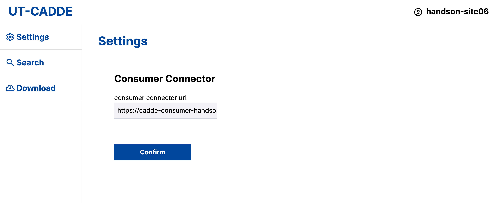
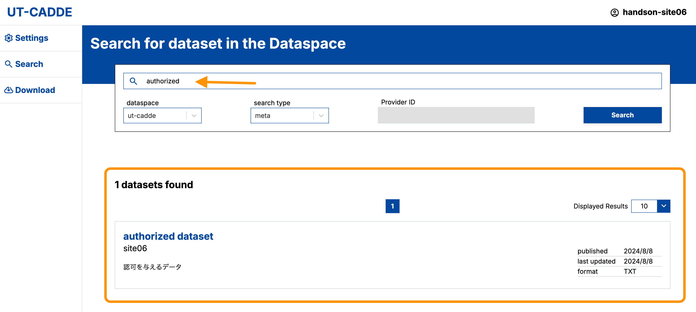
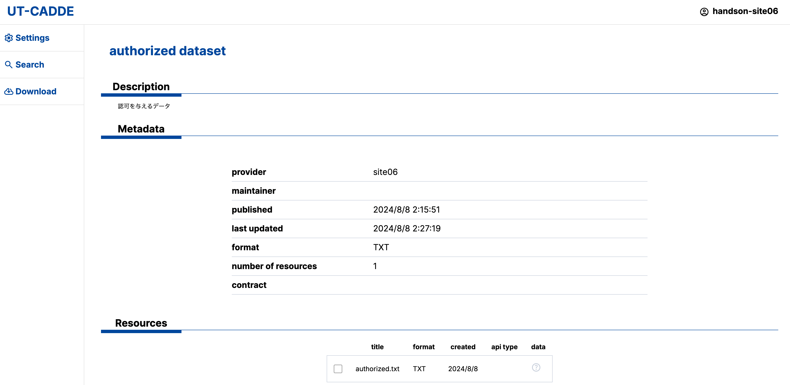
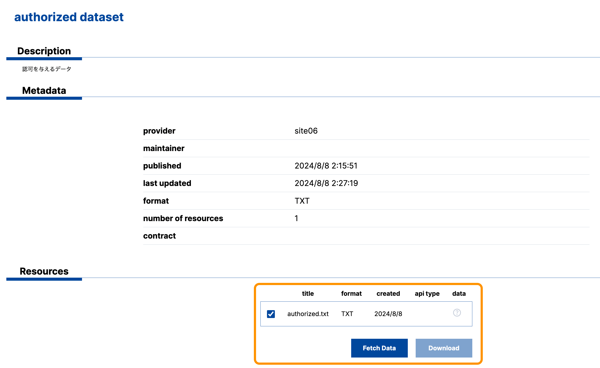

# CADDEテストベッド ハンズオン

本資料は、データスペース技術国際テストベッド「第3回テストベッドTF CADDE4.0ハンズオン」（2024年8月23日）で用いられるものである。

<!-- omit in toc -->
## 目標

本ハンズオンでは、AWS上に構築したハンズオン環境において、データ利用者環境・データ提供者環境をそれぞれ構築し、それらの間でCADDEを通じたデータ検索・取得を達成することを目的とする。

本ハンズオンにおいて、データ提供者はデータ利用者に対して「認可を与えるデータ」「認可を与えないデータ」の2種類を提供するようにすることで、CADDEによる主権的なデータ共有を実践する。


<!-- omit in toc -->
## 前提

<!-- omit in toc -->
### ハンズオン環境について

ハンズオン環境はAWS上に構築され、データスペース技術国際テストベッドに参加している各社ごとに割り当てられる。

ハンズオン環境を構成するホスト情報は以下の通り。

- EC2（t3.medium）：2台
  - OS：Ubuntu 22.04
  - CPU：2コア
  - メモリ：4GB
  - ディスク：40GB

2つの仮想マシンのうち、1つをデータ提供者環境（・WireGuardルータ）、もう1つをデータ利用者環境として構築することとする。

データ提供者環境には以下の4つのアプリケーション用コンテナを構築する。

- HTTPサーバ
- 提供者カタログサイト
- 認可機能
- 提供者コネクタ

データ利用者環境には以下の2つのアプリケーション用コンテナを構築する。

- 利用者コネクタ
- 利用者WebApp

<!-- omit in toc -->
### CADDEテストベッド参加のための事前準備

CADDEテストベッドの利用は、以下の[CADDEテストベッド参加のための事前準備](./README.md#caddeテストベッド参加のための事前準備)が完了していることを前提とする。

1. CADDEテストベッド利用情報の取得
2. CADDEテストベッド参加者環境のドメイン登録
3. CADDEテストベッド用TLS証明書の取得

本ハンズオンでは、CADDE参加者環境の構築・設定およびCADDEの利用方法に焦点を当てるため、ハンズオン専用の準備情報を事前に割り当てる。
そのため、ハンズオン参加者が上記の事前準備を行う必要はない。

<!-- omit in toc -->
## ハンズオン手順

<!-- omit in toc -->
### 目次

- [1. 実行環境の準備](#1-実行環境の準備)
- [2. CADDE参加者環境の構築](#2-cadde参加者環境の構築)
  - [2.1. データ提供者環境](#21-データ提供者環境)
  - [2.2. データ利用者環境](#22-データ利用者環境)
- [3. CADDEでデータを提供する](#3-caddeでデータを提供する)
  - [3.1. データサーバを構築する](#31-データサーバを構築する)
  - [3.2. データ原本情報を登録する](#32-データ原本情報を登録する)
  - [3.3. データカタログを作成する](#33-データカタログを作成する)
  - [3.4. 認可を設定する](#34-認可を設定する)
  - [3.5. 提供者コネクタとデータサーバを接続する](#35-提供者コネクタとデータサーバを接続する)
- [4. CADDEでデータを取得する](#4-caddeでデータを取得する)
  - [4.1. ユーザ認証](#41-ユーザ認証)
  - [4.2. 利用者コネクタの接続設定](#42-利用者コネクタの接続設定)
  - [4.3. 横断検索によってデータを発見する](#43-横断検索によってデータを発見する)
  - [4.4. データ提供者からデータを取得する](#44-データ提供者からデータを取得する)
- [5. CADDE上のデータの来歴を確認する](#5-cadde上のデータの来歴を確認する)

### 1. 実行環境の準備

CADDE参加者環境の構築・利用は、以下のコマンドおよびソフトウェアが利用可能であることを前提とする。

- Docker（v20.10.1 以上）
- Git
- curl
- jq
- OpenSSL（v1.1.1 以上）

以下にこれらをインストールするためのコマンド例を示す。

0. パッケージリストの更新

    ```bash
    sudo apt-get update
    ```

1. docker

    [公式サイト](https://docs.docker.com/engine/install/ubuntu/)の手順に従ってインストールする。

    ```bash
    # Add Docker's official GPG key:
    $ sudo apt-get install ca-certificates curl
    $ sudo install -m 0755 -d /etc/apt/keyrings
    $ sudo curl -fsSL https://download.docker.com/linux/ubuntu/gpg -o /etc/apt/keyrings/docker.asc
    $ sudo chmod a+r /etc/apt/keyrings/docker.asc

    # Add the repository to Apt sources:
    $ echo \
    "deb [arch=$(dpkg --print-architecture) signed-by=/etc/apt/keyrings/docker.asc] https://download.docker.com/linux/ubuntu \
    $(. /etc/os-release && echo "$VERSION_CODENAME") stable" | \
    sudo tee /etc/apt/sources.list.d/docker.list > /dev/null
    $ sudo apt-get update

    $ sudo apt-get install docker-ce docker-ce-cli containerd.io docker-buildx-plugin docker-compose-plugin
    ```

    自分のユーザをdockerグループに追加し、sudoなしでdockerコマンドを実行可能にする。

    この設定は、シェルにログインし直すことで有効になる。

    ```bash
    sudo usermod -aG docker $USER
    ```

2. その他

    ```bash
    sudo apt-get install curl git jq openssl
    ```

---

### 2. CADDE参加者環境の構築

#### 2.1. データ提供者環境

データ提供者環境の構築手順は[provider.md](./provider.md)を参照する。

データ提供者環境の構築後に準備すべき[データ提供設定](./provider.md#3-データ提供設定)については、本資料「[3. CADDEでデータを提供する](#3-caddeでデータを提供する)」にて扱う。

#### 2.2. データ利用者環境

データ利用者環境の構築手順は[consumer.md](./consumer.md)を参照する。

---

### 3. CADDEでデータを提供する

本章では、データ提供者がコネクタを経由してCADDE上にデータを提供する手順を実践する。

#### 3.1. データサーバを構築する

本CADDEハンズオンで利用するデータサーバを、提供者コネクタからのみアクセス可能な非公開のHTTPサーバとして構築する。

そのために、データ提供者環境を構築したものと同じホスト上で、HTTPサーバ用Dockerコンテナを起動する。

データサーバを非公開にするためには、データ提供者環境内部の独自ドメインを用いる。<br/>
具体的には、HTTPサーバ用Dockerコンテナに対して、提供者コネクタのみが名前解決できる独自ドメインを割り当てるようにする。

##### HTTPサーバ用Dockerコンテナの起動

まず、データ提供者環境のホストにログインした上で、作業用ディレクトリを作成する。

```bash
mkdir -p ~/cadde_testbed/private-http-server
```

HTTPサーバ上に保持されるデータを格納するためのディレクトリを作成する。

```bash
cd ~/cadde_testbed/private-http-server
mkdir data
```

そして、`compose.yml`という名前のファイルを新たに作成し、次の内容に編集する。

```bash
cd ~/cadde_testbed/private-http-server
vim compose.yml
```

```yaml
services:
    nginx:
      image: nginx:alpine
      ports:
        - "8080:80"
      volumes:
        - ./data:/usr/share/nginx/html
```

なお、コンテナを公開するポート番号（上記では8080番）は各環境に合わせて適宜変更する。

最後に、以下のコマンドを実行し、HTTPサーバ用のDockerコンテナを起動する。

```bash
cd ~/cadde_testbed/private-http-server
docker compose up -d
```

##### HTTPサーバにデータを配置する

本ハンズオンでは、データ提供者は「認可を与えるデータ」「認可を与えないデータ」の2種類を提供する。

そこで、HTTPサーバ上にもこれら2種類のデータを以下のディレクトリに配置する。

- `~/cadde_testbed/private-http-server/data`

配置するデータの中身は各ハンズオン参加者が自由に決定できる。<br/>
本資料では参考として単純なテキストファイルを作成する例を示す。

```bash
cd ~/cadde_testbed/private-http-server

echo "Authorized data from CADDE." > ./data/authorized.txt
echo "Unauthorized data from CADDE." > ./data/unauthorized.txt
```

配置したデータは以下のURLから確認できる。

- `http://<データ提供者環境用ホストのIPアドレス>:8080/<dataディレクトリ以下のパス>`
  - 例：`http://10.250.245.10:8080/authorized.txt`

```bash
$ curl http://10.250.245.10:8080/authorized.txt
Authorized data from CADDE.
```

##### HTTPサーバ用Dockerコンテナに独自ドメインを割り当てる

データサーバを非公開にするために、Dockerコンテナに対して独自ドメインを割り当てる。

提供者コネクタが起動中の状態であれば、一度終了させる。

```bash
cd ~/cadde_testbed/klab-connector-v4/src/provider
sh stop.sh
```

次に、以下のファイルを編集し、提供者コネクタ`connector-main`コンテナ内にデータサーバ用の独自ドメインとIPアドレスの対応を追加する。

- `klab-connector-v4/src/provider/docker-compose.yml`

設定すべき項目は以下の通り。

- services
  - provider-connector-main
    - **`extra_hosts`**
      - コンテナ内のみで解決される独自ドメインを以下のフォーマットで追加する
        - `<domain>:<IP address>`
      - データサーバ用ドメインの文字列はハンズオン環境に合わせて決定する
        - `data-management.<sitename>.internal`（例：`data-management.site06.internal`）

以下に設定例を示す。

```yaml
services:
  provider-connector-main:
    ...
    extra_hosts:
      - "data-management.<sitename>.internal:host-gateway"
```

※ ここでは、データサーバと提供者コネクタが同一IPアドレスのホスト上で構築されていることを前提としている。

独自ドメインの設定が完了すれば、提供者コネクタを再度起動する。

```bash
cd ~/cadde_testbed/klab-connector-v4/src/provider
sh start.sh
```

---

#### 3.2. データ原本情報を登録する

HTTPサーバに配置した2種類のデータそれぞれの原本情報を来歴管理機能に新たに登録する。

原本情報の登録には来歴管理機能の履歴登録APIを用いる。<br/>
履歴登録APIを用いたデータ原本情報の登録リクエストの詳細は[provider.md](./provider.md#31-データ原本情報の登録)を参照する。

データ提供者環境のホストにログインした上で、以下のコマンドを順に実行する。

ハンズオン環境では、データアクセスURLおよびデータファイルパスの記述に注意すること。

- データのアクセスURL **`cdluri`**
  - 「[3.1. データサーバを構築する](#31-データサーバを構築する)」で割り当てた独自ドメインを使って記述する
  - 例：`http://data-management.<sitename>.internal:8080/authorized.txt`
- データファイルのパス **`data_file`**
  - 「[3.1. データサーバを構築する](#31-データサーバを構築する)」で配置したファイルの絶対パスを記述する
  - 例：`/home/ubuntu/cadde_testbed/private-http-server/data/authorized.txt`

```bash
# 1つ目のサブパート：JSONを作成 -> 一時ファイルに保存
json_request=$(cat <<EOF
{
  "cdldatamodelversion": "2.0",
  "cdleventtype": "Create",
  "dataprovider": "<データ提供者のCADDEユーザID>",
  "cdldatatags": [
    {
      "cdluri": "<データアクセスURL>"
    }
  ]
}
EOF
)

json_temp_file=$(mktemp)
echo "$json_request" > "$json_temp_file"

# 2つ目のサブパート：原本となるデータファイルの絶対パスを記述
data_file=<提供データファイルの絶対パス>

# 原本情報登録リクエスト
curl -v -sS -X POST "http://cadde-provenance-management.koshizukalab.dataspace.internal:3000/v2/eventwithhash" \
-F "request=@$json_temp_file;type=application/json" \
-F "upfile=@$data_file;type=text/plain" \
| jq '.'
```

データ原本情報の登録リクエストに成功すると、データ原本情報の登録イベントを識別するIDが返される。
このIDは後述する「[3.3. データカタログを作成する](#33-データカタログを作成する)」用に記録しておく。

HTTPサーバに配置した2種類のデータそれぞれについて、原本情報の登録が成功すれば完了である。

```json
{
  "cdleventid": "XXX"
}
```

---

#### 3.3. データカタログを作成する

HTTPサーバに配置した2種類のデータそれぞれについて、提供者カタログサイト上でデータカタログを作成する。

データカタログの作成手順は[provider.md](./provider.md#32-データカタログの作成)を参照する。

以下のように2種類のデータそれぞれについてデータカタログを作成できれば完了である。


---

#### 3.4. 認可を設定する

先述の通り、本ハンズオンではデータ利用者に対して「認可を与えるデータ」「認可を与えないデータ」の2種類を提供する。

したがって、HTTPサーバに配置した2種類のデータの認可設定を行う。

2種類のデータそれぞれについて、設定する認可の条件は以下の通り。

- 認可を与えるデータ
  - リソースURL
    - 「認可を与えるデータ」のURL
    - 例：`http://data-management.<sitename>.internal:8080/authorized.txt`
  - ユーザに対する認可
    - 自分のハンズオン用CADDEユーザIDを指定する
- 認可を与えないデータ
  - リソースURL
    - 「認可を与えないデータ」のURL
    - 例：`http://data-management.<sitename>.internal:8080/unauthorized.txt`
  - ユーザに対する認可
    - 自分のハンズオン用CADDEユーザID以外の適当な文字列を指定する

認可を設定するための詳細な手順は[provider.md](./provider.md#33-認可の設定)を参照する。

---

#### 3.5. 提供者コネクタとデータサーバを接続する

HTTPサーバに配置した2種類のデータのロケーションを提供者コネクタに設定する。

詳細な手順は[provider.md](./provider.md#34-データサーバの接続設定)を参照する。

データ提供者環境のホストにログインした上で、以下のファイルを編集する。

- `klab-connector-v4/src/provider/connector-main/swagger_server/configs/http.json`

このとき、設定するデータのURLは、データ原本情報の登録・データカタログの作成の際と同じく、HTTPサーバに割り当てた独自ドメインを使って記述することに注意する。

以下に設定例を示す。
データURLは各自の環境に応じて適宜設定する。

```json
{
    "basic_auth": [],
    "authorization": [
        {
            "url": "http://data-management.siteXX.internal:8080/authorized.txt",
            "enable": true
        },
        {
            "url": "http://data-management.siteXX.internal:8080/unauthorized.txt",
            "enable": true
        }
    ],
    "contract_management_service": [
        {
            "url": "http://data-management.siteXX.internal:8080/authorized.txt",
            "enable": false
        },
        {
            "url": "http://data-management.siteXX.internal:8080/unauthorized.txt",
            "enable": false
        }
    ],
    "register_provenance": [
        {
            "url": "http://data-management.siteXX.internal:8080/authorized.txt",
            "enable": true
        },
        {
            "url": "http://data-management.siteXX.internal:8080/unauthorized.txt",
            "enable": true
        }
    ]
}
```

---

### 4. CADDEでデータを取得する

本章では、データ利用者が利用者WebApp・利用者コネクタを介して、CADDEからデータを取得する手順を実践する。

#### 4.1. ユーザ認証

利用者WebAppトップページからハンズオン用のCADDEユーザID・パスワードを入力してログインする。


このとき、背後では利用者WebAppが認証機能にリクエストを行なってCADDE利用者トークンを取得している。
CADDE利用者トークンはCADDEユーザに関する情報を含んでおり、後述する詳細検索やデータ取得における認可判断に利用される。

#### 4.2. 利用者コネクタの接続設定

ログインに成功すると次の画面に遷移する。

ここでWebAppが接続先とする利用者コネクタURLを指定し、`Confirm`を押す。

- 例：`https://cadde-consumer-handson.siteXX.dataspace.internal:443/`



#### 4.3. 横断検索によってデータを発見する

利用者WebApp画面左側のメニューから`Search`を選択し、データ検索画面に遷移する。


画面上部の検索窓に、作成したデータカタログのタイトルやデータURLなどの情報を一部入力して検索する。

ここで`search_type`の欄の`meta`という値が、データカタログの横断検索リクエストを行うことを示している。<br/>
このとき、背後では利用者WebAppが横断検索機能にリクエストを行ない、クローリングされたデータカタログの一覧を取得している。

検索結果が表示され、データカタログページに遷移して情報を確認することができれば完了である。

以下に画面例を示す。




<!-- ####  4.3. 詳細検索によってデータカタログを取得する -->
<!-- ここでは

利用者WebApp画面左側のメニューから`Search`を選択し、次のデータ検索画面に遷移する。


画面上部の検索窓に[作成したデータカタログ](#33-データカタログを作成する)のタイトルやデータURLなどの情報を一部入力して検索する。

ここで`search_type`の欄の`meta`という値が、データカタログの横断検索リクエストを行うことを示している。
このとき、背後では利用者WebAppが横断検索機能にリクエストを行なってクローリングされたデータカタログの一覧を取得している。

検索結果が表示され、データカタログページに遷移して情報を確認することができれば完了である。

以下に画面例を示す。


 -->

#### 4.4. データ提供者からデータを取得する

##### 認可ありのデータ

データ検索結果から、「認可ありのデータ」のデータセットページに遷移し、取得したいリソースにチェックを入れる。



この状態で`Fetch Data`を押すと、背後で利用者WebAppが提供者コネクタに対してデータ取得リクエストを送信する。

データ提供者環境でデータアクセスが認可されれば、実際にデータが転送される。
その結果、取得できたリソースに緑色のチェックマークが表示される。


この状態で`Download`を押せば、ブラウザにデータがダウンロードされ、CADDEを通じたデータ転送が完了する。

##### 認可なしのデータ

「認可なしのデータ」に対して、`Fetch Data`を押してデータ取得リクエストを送信すると、以下のエラーメッセージが表示される。


これは、データ提供者環境で、当該データに対するアクセスが認可されていないことを示すものである。

---

### 5. CADDE上のデータの来歴を確認する

最後に、CADDE上で共有されたデータの来歴確認（データ交換・加工の履歴）を実践する。
ここでは、認可を与えるデータ、認可を与えないデータそれぞれに対して来歴を確認する。

データの来歴を確認するためには、来歴管理機能の来歴確認APIを利用する。<br/>
来歴管理機能APIの詳細な仕様は、[CADDE来歴管理システム設計書](https://github.com/CADDE-sip/documents/tree/cd02836c046054d9661f9963d3801cc9fd230631/doc/2/50_V4_%E3%83%A6%E3%83%BC%E3%82%B9%E3%82%B1%E3%83%BC%E3%82%B9%E5%9F%BA%E6%9C%AC%E8%A8%AD%E8%A8%88%E6%9B%B8/70_V4_%E8%A8%AD%E8%A8%88%E6%9B%B8_%E6%9D%A5%E6%AD%B4%E7%AE%A1%E7%90%86%E3%82%B7%E3%82%B9%E3%83%86%E3%83%A0%E8%A8%AD%E8%A8%88%E6%9B%B8)を参照すること。

来歴確認APIの実行例は以下の通り。

パスパラメータにデータの原本情報を登録した際に得られるイベントIDを指定する。

```bash
curl -v -sS "http://cadde-provenance-management.koshizukalab.dataspace.internal:3000/v2/lineage/<原本情報登録イベントID>?direction=BOTH&depth=-1" \
| jq '.'
```

APIの実行に成功すると、認可を与えるデータについては以下のような3つのJSONオブジェクトが入ったリストが返される。

```json
[
  {
    "cdldatamodelversion": "2.0",
    "cdldatatags": [
      {
        "cdlsha256hash": "c38653b18b0f815ba7d5d08f86a66aa8d2a3250e9f2c858b57cbeff6b5201264",
        "cdluri": "http://data-management.site06.internal:8080/authorized.txt"
      }
    ],
    "cdleventid": "f16e3276-8726-4a12-a537-1befef69d9ca",
    "cdleventtype": "Create",
    "cdlnextevents": [
      "e7db1c00-cbd6-44a4-86b2-0926965b3909"
    ],
    "cdlorganization": "org01.cdl.com",
    "cdlpreviousevents": [],
    "cdltimestamp": "2024-08-07T19:29:38.949Z",
    "dataprovider": "handson-site06"
  },
  {
    "cdldatamodelversion": "2.0",
    "cdleventid": "e7db1c00-cbd6-44a4-86b2-0926965b3909",
    "cdleventtype": "Sent",
    "cdlnextevents": [
      "91d25340-f184-447d-9793-207fa65b90e2"
    ],
    "cdlorganization": "org01.cdl.com",
    "cdlpreviousevents": [
      "f16e3276-8726-4a12-a537-1befef69d9ca"
    ],
    "cdltimestamp": "2024-08-08T03:10:01.792Z",
    "dataprovider": "handson-site06",
    "datauser": "handson-site06"
  },
  {
    "cdldatamodelversion": "2.0",
    "cdleventid": "91d25340-f184-447d-9793-207fa65b90e2",
    "cdleventtype": "Received",
    "cdlnextevents": [],
    "cdlorganization": "org01.cdl.com",
    "cdlpreviousevents": [
      "e7db1c00-cbd6-44a4-86b2-0926965b3909"
    ],
    "cdltimestamp": "2024-08-08T03:10:03.909Z",
    "dataprovider": "handson-site06",
    "datauser": "handson-site06"
  }
]
```

各JSONオブジェクトは来歴管理上の1つのイベントに対応し、主に次のような情報を持つ。

- **`cdleventid`**
  - イベントの識別子
- **`cdleventtype`**
  - イベント種別
  - `Create`
    - データ原本情報の登録
    - データ提供準備時に作成
  - `Sent`
    - データ送信履歴
    - データ取得リクエストが認可された場合に提供者コネクタが自動で作成
  - `Received`
    - データ受信履歴
    - データ取得リクエストが成功した場合に利用者コネクタが自動で作成
- **`cdlnextevents`**
  - 当該イベント直後のイベントID
- **`cdlpreviousevents`**
  - 当該イベント直前のイベントID
- **`cdltimestamp`**
  - 当該イベント発生時の日時
- **`dataprovider`**
  - データ提供者のCADDEユーザID
- **`datauser`**
  - データ利用者のCADDEユーザID

一方、認可を与えないデータについては、データの送信および受信が実行されていないため、以下のようにデータ原本情報の登録イベントだけが格納されたリストが返される。

```json
[
  {
    "cdldatamodelversion": "2.0",
    "cdldatatags": [
      {
        "cdlsha256hash": "daa99d24e9df77ebc8756a34b61bb34cb621951f37b489c30bc448ad28eb5ba8",
        "cdluri": "http://data-management.site06.internal:8080/unauthorized.txt"
      }
    ],
    "cdleventid": "3d7bbfcf-3764-4937-b106-f1b14fa01416",
    "cdleventtype": "Create",
    "cdlnextevents": [],
    "cdlorganization": "org01.cdl.com",
    "cdlpreviousevents": [],
    "cdltimestamp": "2024-08-07T19:37:02.613Z",
    "dataprovider": "handson-site06"
  }
]
```
