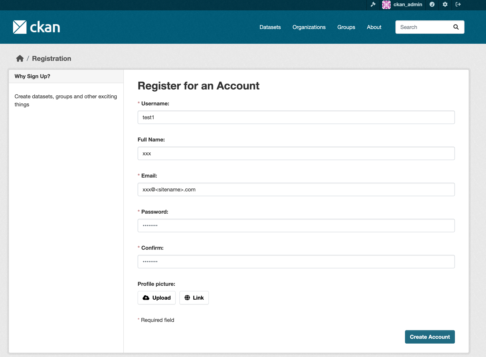

# データ提供者環境の構築

<!-- omit in toc -->
## 目次

- [1. 前提](#1-前提)
  - [1.1. CADDEテストベッド参加のための事前準備](#11-caddeテストベッド参加のための事前準備)
  - [1.2. 実行環境](#12-実行環境)
  - [1.3. 提供データ](#13-提供データ)
- [2. インストール](#2-インストール)
  - [2.1. 提供者カタログサイト](#21-提供者カタログサイト)
    - [2.1.1. CKANの構築](#211-ckanの構築)
    - [2.1.2. CKANの初期設定](#212-ckanの初期設定)
  - [2.2. 提供者コネクタ](#22-提供者コネクタ)
    - [2.2.1. ソースコードの取得](#221-ソースコードの取得)
    - [2.2.2. 共通ファイルの展開](#222-共通ファイルの展開)
    - [2.2.3. リバースプロキシの設定](#223-リバースプロキシの設定)
    - [2.2.4. データカタログの接続設定](#224-データカタログの接続設定)
    - [2.2.5. 来歴管理の接続設定](#225-来歴管理の接続設定)
    - [2.2.6. その他カスタマイズ可能な項目](#226-その他カスタマイズ可能な項目)
    - [2.2.7. 提供者コネクタの起動](#227-提供者コネクタの起動)
    - [2.2.8. （参考）提供者コネクタの停止](#228-参考提供者コネクタの停止)
  - [2.3. 認可機能](#23-認可機能)
    - [2.3.1. ソースコードの取得](#231-ソースコードの取得)
    - [2.3.2. Dockerイメージの作成](#232-dockerイメージの作成)
    - [2.3.3. 認可用Keycloakの初期設定](#233-認可用keycloakの初期設定)
    - [2.3.4. 認証機能との連携に関する設定](#234-認証機能との連携に関する設定)
    - [2.3.5. 認可機能の起動](#235-認可機能の起動)
    - [2.3.6. 認可機能の初期セットアップ](#236-認可機能の初期セットアップ)
    - [2.3.7. 提供者コネクタと認可機能の接続設定](#237-提供者コネクタと認可機能の接続設定)
    - [2.3.8. （参考）認可機能の停止](#238-参考認可機能の停止)
- [3. データ提供設定](#3-データ提供設定)
  - [3.1. データ原本情報の登録](#31-データ原本情報の登録)
  - [3.2. データカタログの作成](#32-データカタログの作成)
    - [3.2.1. データセットのメタデータ設定](#321-データセットのメタデータ設定)
    - [3.2.2. リソース（ファイル）のメタデータ設定](#322-リソースファイルのメタデータ設定)
    - [3.2.3. リソースに対する拡張項目の設定](#323-リソースに対する拡張項目の設定)
  - [3.3. 認可の設定](#33-認可の設定)
    - [3.3.1. （参考）認可一覧メニュー](#331-参考認可一覧メニュー)
    - [3.3.2. （参考）認可機能の設定メニュー](#332-参考認可機能の設定メニュー)
  - [3.4. データサーバの接続設定](#34-データサーバの接続設定)

## 1. 前提

### 1.1. CADDEテストベッド参加のための事前準備

CADDEテストベッドの利用開始にあたって、テストベッド参加者は[CADDEテストベッド参加のための事前準備](./README.md#caddeテストベッド参加のための事前準備)を行う必要がある。

以降のデータ提供者環境の構築にあたっては、以下の作業が完了していることを前提とする。

- [CADDEテストベッド利用情報の取得](./README.md#11-caddeテストベッド利用情報の取得)
- [CADDEテストベッド参加者環境のドメイン登録](./README.md#12-caddeテストベッド参加者環境のドメイン登録)
- [CADDEテストベッド用TLS証明書の取得](./README.md#13-caddeテストベッド用tls証明書の取得)

### 1.2. 実行環境

データ提供者環境を構築するマシンは以下の条件を満たすことを前提とする。

- OS：Linux
- CPU：2コア
- メモリ：4GB
- ディスク：20GB

また、以下のコマンドおよびソフトウェアが利用可能であることを前提とする。

- Docker（v20.10.1 以上）
- Git
- curl
- jq
- OpenSSL（v1.1.1 以上）

### 1.3. 提供データ

データ提供者環境は、CADDE上で提供するためのデータおよびデータを保管するデータサーバが存在することを前提とする。

CADDE上で提供されるデータについて、提供者コネクタでは以下のデータサイズを満たすデータのみがサポートされている。

- コンテキスト情報：1MB 以下
- ファイル：100MB 以下

また、データサーバは、HTTP / FTP / NGSIのいずれかのプロトコルによって提供者コネクタからアクセス可能であることを前提とする。
なお、CADDEテストベッドではデータサーバとしてHTTPサーバを構築することを推奨する。

データサーバは提供者コネクタからアクセス可能であれば、公開サーバ・非公開サーバのどちらでもよい。
基本的には、データ提供時の認可が不要であれば公開サーバ、認可を必要とするなら非公開サーバとする使い分けが一般的である。

## 2. インストール

データ提供者環境では、以下3つのアプリケーションを構築する。

- 提供者カタログサイト
- 提供者コネクタ
- 認可機能

はじめに、以降の作業用ディレクトリを作成し、環境変数`${WORKDIR}`で参照することとする。

```bash
mkdir ~/cadde_testbed
cd ~/cadde_testbed
export WORKDIR=$PWD
```

### 2.1. 提供者カタログサイト

#### 2.1.1. CKANの構築

[CKAN公式ドキュメントのインストール手順](https://docs.ckan.org/en/2.10/maintaining/installing/index.html)に従い、CKANサイトを構築する（参考：[CKANの推奨動作環境](https://github.com/ckan/ckan/wiki/Hardware-Requirements)）。

以下では参考として、Dockerコンテナを用いたCKANサイトの構築手順を示す。

まず、GitHubからDockerコンテナを用いたCKANサイト構築用のリポジトリをクローンする。

```bash
cd ${WORKDIR}
git clone https://github.com/ckan/ckan-docker.git
```

##### CKAN構築時の設定

CKANの設定は、`.env`ファイルに記載される環境変数を用いて行う。

参考用の環境変数が`.env.example`に存在するため、このファイルを`.env`としてコピーする。

```bash
cd ${WORKDIR}/ckan-docker
cp .env.example .env
```

`.env`ファイル内で、主に設定すべき項目は以下の通り。
なお、**`CKAN_SITE_URL`** 以外の項目についてはデフォルトの記載内容のまま変更しなくてもよい。

- **`NGINX_SSLPORT_HOST`**
  - CKANコンテナを公開するポート番号
  - デフォルト：`8443`
- **`CKAN_SITE_URL`**
  - CKANサイトのドメイン名 + ポート番号
  - CADDEテストベッド参加の事前準備で取得した提供者カタログサイトのドメイン名を用いる
  - デフォルト：`https://localhost:8443`
- **`CKAN_SYSADMIN_NAME`**
  - CKANサイト管理者のユーザ名
  - デフォルト：`ckan_admin`
- **`CKAN_SYSADMIN_PASSWORD`**
  - CKANサイト管理者のパスワード（英数字8文字以上）
  - デフォルト：`test1234`

さらに、CKAN用Dockerfile（`ckan-docker/ckan/Dockerfile`）を編集し、CKANイメージのバージョンを2.10系に書き換える。

```diff
- FROM ckan/ckan-base:2.11.0
+ FROM ckan/ckan-base:2.10

# Install any extensions needed by your CKAN instance
# See Dockerfile.dev for more details and examples

# Copy custom initialization scripts
COPY docker-entrypoint.d/* /docker-entrypoint.d/

# Apply any patches needed to CKAN core or any of the built extensions (not the
# runtime mounted ones)
COPY patches ${APP_DIR}/patches

RUN for d in $APP_DIR/patches/*; do \
        if [ -d $d ]; then \
            for f in `ls $d/*.patch | sort -g`; do \
                cd $SRC_DIR/`basename "$d"` && echo "$0: Applying patch $f to $SRC_DIR/`basename $d`"; patch -p1 < "$f" ; \
            done ; \
        fi ; \
    done
```

##### TLSサーバ証明書の配置

次に、提供者カタログサイトのTLSサーバ証明書・秘密鍵をCKANのリバースプロキシに配置する。

配置先のディレクトリとファイル名は以下の通り。

- ディレクトリ：`ckan-docker/nginx/setup`
  - 秘密鍵：`ckan-local.key`
  - TLSサーバ証明書：`ckan-local.crt`

リポジトリからクローンした段階で、秘密鍵・TLSサーバ証明書はすでに存在しているため、これらをCADDEテストベッド参加用の秘密鍵・TLSサーバ証明書で置き換える。

ディレクトリが以下の状態になれば完了である。

```bash
$ ls ${WORKDIR}/ckan-docker/nginx/setup/
ckan-local.crt  ckan-local.key  default.conf  index.html  nginx.conf
```

さらに、CKANのリバースプロキシ用コンテナのDockerfile（`ckan-docker/nginx/Dockerfile`）を以下の内容に書き換える。

```dockerfile
FROM nginx:stable-alpine

ENV NGINX_DIR=/etc/nginx

RUN apk update --no-cache && \
    apk upgrade --no-cache && \
    apk add --no-cache openssl

COPY setup/nginx.conf ${NGINX_DIR}/nginx.conf
COPY setup/index.html /usr/share/nginx/html/index.html
COPY setup/default.conf ${NGINX_DIR}/conf.d/

RUN mkdir -p ${NGINX_DIR}/certs

COPY setup/ckan-local.crt ${NGINX_DIR}/certs/ckan-local.crt
COPY setup/ckan-local.key ${NGINX_DIR}/certs/ckan-local.key

ENTRYPOINT nginx -g 'daemon off;'
```

##### CKAN用コンテナ群の起動

最後に、以下のコマンドを実行し、提供者カタログCKAN用のDockerコンテナ群を起動する。

```bash
cd ${WORKDIR}/ckan-docker
docker compose build
docker compose up -d
```

提供者カタログの起動状況は以下のコマンドで確認できる。
6つのコンテナすべてが立ち上がっていれば完了である。

```bash
cd ${WORKDIR}/ckan-docker
docker compose ps
```

#### 2.1.2. CKANの初期設定

##### ユーザの作成

CKANの起動直後は管理者用アカウントしか存在しない。

そこで、CKAN上でCADDEデータ提供者に対応する新たなユーザを作成する。

新たなユーザを作成する場合、まず提供者カタログサイトに管理者としてログインする。


その後、以下のエンドポイントからユーザ作成画面に遷移する。

- `https://<CKANサイトドメイン>:<ポート番号>/user/register`

この画面上で、ユーザ名・パスワードを設定し、データ提供者に対応するユーザを作成する。



なお、CKAN上のユーザ名・パスワードは必ずしもCADDEユーザのユーザ名・パスワードと一致していなくともよいが、同じものを設定することを推奨する。
また、ユーザ作成時に入力するメールアドレスについては、メールサーバと連携しない場合には不要であるため、適当な文字列を入力すればよい。

以下のエンドポイントにあるユーザ一覧から、作成したユーザが含まれていることを確認できれば完了である。

- `https://<CKANサイトドメイン>:<ポート番号>/user`


##### 組織（Organization）の作成

CKANではデータカタログを組織単位（Organizations）でまとめることができる。

そこで、CKANサイト上でCADDEテストベッドに参加している組織（WireGuardサイト）に対応する新たな組織を作成する。

新たな組織を作成する場合、まず作成したユーザでCKANサイトにログインする（管理者アカウントでないことに注意）。

その後、画面上部`Organizations`メニューに遷移し、`Add Organization`から新たな組織を作成する。


組織情報の入力画面では、組織名として各WireGuardサイトのsitenameに対応する英文字列を入力することを推奨する。

例えば、東京大学越塚研究室のWireGuardサイト上で構築されるデータ提供者環境では、`koshizukalab`を入力する。
また、組織の説明欄（Description）は任意で入力すればよい。


##### CKAN APIキーの作成

一部のCKAN APIを利用するためには、CKAN APIキーが必要となる。

以下にCKAN APIキーの取得手順を示す。

まず、CKANサイトにユーザログインした状態で、画面右上からユーザページに遷移する。


次にユーザページ上部のメニューから`API Tokens`を選択し、発行するAPIキーの名前を入力する。


`Create API Token`を押すと、新たなAPIキーが発行される。
APIキーはこの画面でしか表示されないため、後で利用するために記録しておく。


<!-- #### 2.1.3. CKANの動作確認

##### GUI

CKAN公式ドキュメント[User guide > Using CKAN](https://docs.ckan.org/en/2.10/user-guide.html#using-ckan)を参考に、CKAN上で新しいカタログの作成や既存のカタログの検索ができるか確認する。

##### API

CKAN公式ドキュメント[API guide](https://docs.ckan.org/en/2.10/api/index.html)を参考に、APIを通じて以下を実行できるか確認する。

- カタログ一覧の取得
  - `/api/action/package_list`
- 指定したカタログの取得
  - `/api/action/package_show?id=<カタログID>`
- カタログの検索
  - `/api/action/package_search?q=<検索キーワード>` -->

<!-- ### 2.1.4. 横断検索機能への登録申請 -->

<!-- 横断検索機能が提供者カタログサイトをクローリング対象として登録するための申請を行う。

横断検索機能は東京大学越塚研究室が管理しているため、CADDEテストベッド参加者は以下の情報を越塚研究室の担当者に送付する。
- 提供者カタログサイト名
  - 例：`越塚研究室カタログサイト`
- 提供者カタログサイトのドメイン名
  - 例：`cadde-catalog-test1.koshizukalab.dataspace.internal`

横断検索機能の登録完了通知を受け取り、横断検索サイト上で自身が提供するデータカタログの閲覧・検索ができることを確認できれば完了である。 -->

---

### 2.2. 提供者コネクタ

#### 2.2.1. ソースコードの取得

GitHubからCADDEコネクタリポジトリをクローンする。

```bash
cd ${WORKDIR}
git clone https://github.com/Koshizuka-lab/klab-connector-v4.git
cd klab-connector-v4
git switch testbed
```

ブランチが`testbed`であることを確認する。

```bash
$ git branch
  main
* testbed
```

`klab-connector-v4/src/provider`に提供者コネクタ用ソースコードが配置してある。

#### 2.2.2. 共通ファイルの展開

`setup.sh`を実行する。

```bash
cd ${WORKDIR}/klab-connector-v4/src/provider
sh setup.sh
```

#### 2.2.3. リバースプロキシの設定

提供者コネクタに対する通信はHTTPSによる接続が推奨される。
また、CADDEはデータ共有の信頼性を高めるため、利用者コネクタ - 提供者コネクタ間の相互TLS通信をサポートしている。

CADDEテストベッド用TLS証明書をリバースプロキシに配置するための設定を行う。

##### 秘密鍵・サーバ証明書の準備

[CADDEテストベッド参加のための事前準備](#11-caddeテストベッド参加のための事前準備)で取得した秘密鍵・TLS証明書を配置するディレクトリを作成する。

このディレクトリはリバースプロキシ用Dockerコンテナにマウントされる。

```bash
mkdir -p ${WORKDIR}/klab-connector-v4/src/provider/nginx/volumes/ssl
```

作成したディレクトリに秘密鍵とTLS証明書のファイルをそれぞれ配置する。
配置する際のファイル名は以下の通り。

- 秘密鍵：**`server.key`**
- TLS証明書：**`server.crt`**

ディレクトリが以下の状態になれば完了である。

```bash
$ ls ${WORKDIR}/klab-connector-v4/src/provider/nginx/volumes/ssl
server.crt　server.key
```

##### クライアント認証用CA証明書の準備

利用者コネクタ - 提供者コネクタ間の相互TLS通信では、利用者コネクタのクライアント認証を行う。
そのため、利用者コネクタが提示するクライアント証明書のCA証明書を、リバースプロキシ上に配置する。

CA証明書は[CADDEテストベッド参加のための事前準備](#11-caddeテストベッド参加のための事前準備)で取得した`cacert.pem`を用いる。

配置先のディレクトリは秘密鍵・TLSサーバ証明書と同様である。

ディレクトリが以下の状態になれば完了である。

```bash
$ ls ${WORKDIR}/klab-connector-v4/src/provider/nginx/volumes/ssl
cacert.pem  server.crt  server.key
```

#### 2.2.4. データカタログの接続設定

提供データのデータカタログをコネクタ経由で公開するため、提供者カタログサイトURLを以下のファイルに設定する。

- `klab-connector-v4/src/provider/connector-main/swagger_server/configs/provider_ckan.json`

設定すべき項目は以下の通り。

- **`release_ckan_url`**
  - 横断検索用カタログサイトのURL
  - 横断検索用・詳細検索用サイトを1つのCKANサイトでまとめる場合は、`detail_ckan_url`と一致させる
- **`detail_ckan_url`**
  - 詳細検索用カタログサイトのURL
  - 横断検索用・詳細検索用サイトを1つのCKANサイトでまとめる場合は、`release_ckan_url`と一致させる
- **`authorization`**
  - 詳細検索用カタログサイトアクセス時の認可確認有無
- **`packages_search_for_data_exchange`**
  - データ取得時の交換実績記録用リソースID検索の有無
  - データ交換の来歴を記録する場合に必須となる

横断検索用データカタログ・詳細検索用データカタログはいずれもデータ提供者環境に構築される提供者カタログサイトを指すことに注意する。

ここでは横断検索用・詳細検索用データカタログを1つのCKANサイトで提供することを想定しており、`release_ckan_url`と`detail_ckan_url`の値を提供者カタログサイトのURLで一致させる。
一方で、横断検索用・詳細検索用データカタログを異なる2つのCKANサイトで提供するパターンも存在する。
詳しくは[CADDE 4.0 データカタログ項目仕様ガイドライン](https://github.com/CADDE-sip/documents/tree/cd02836c046054d9661f9963d3801cc9fd230631/doc/5/(5-3)_System%20Configuration%E2%80%A6%2C%20Operation%2C%20Management/50_V4_%E3%82%B7%E3%82%B9%E3%83%86%E3%83%A0%E3%82%B3%E3%83%B3%E3%83%95%E3%82%A3%E3%82%B0-%E9%81%8B%E7%94%A8%E7%AE%A1%E7%90%86/20_V4_%E3%82%AC%E3%82%A4%E3%83%89%E3%83%A9%E3%82%A4%E3%83%B3_CADDE4.0%20%E3%83%87%E3%83%BC%E3%82%BF%E3%82%AB%E3%82%BF%E3%83%AD%E3%82%B0%E9%A0%85%E7%9B%AE%E4%BB%95%E6%A7%98%E3%82%AC%E3%82%A4%E3%83%89%E3%83%A9%E3%82%A4%E3%83%B3)を参照すること。

以下に設定例を示す。

```json
{
    "release_ckan_url": "https://cadde-catalog-test1.koshizukalab.dataspace.internal:8443",
    "detail_ckan_url": "https://cadde-catalog-test1.koshizukalab.dataspace.internal:8443",
    "authorization": false,
    "packages_search_for_data_exchange": true
}
```

#### 2.2.5. 来歴管理の接続設定

来歴管理機能を利用する場合、来歴管理サーバURLを以下のファイルに設定する。

- `klab-connector-v4/src/provider/provenance-management/swagger_server/configs/provenance.json`

ただし、来歴管理機能に関する情報はCADDEテストベッド参加者で共通であるため、デフォルトの記載のまま変更しなくともよい。

以下の設定項目が存在する。

- **`provenance_management_api_url`**
  - 来歴管理機能APIのベースURL

以下にデフォルトの設定例を示す。

```json
{
    "provenance_management_api_url": "http://cadde-provenance-management.koshizukalab.dataspace.internal:3000/v2"
}
```

#### 2.2.6. その他カスタマイズ可能な項目

##### 提供者コネクタのポート番号

`docker-compose.yml`を編集することで、提供者コネクタを起動する際のポート番号を変更することができる。

以下の例では提供者コネクタをホストマシンの80, 443番で立ち上げ、コンテナの80, 443番ポートにそれぞれフォワーディングしている。

```yaml
...
services:
  provider-reverse-proxy:
    ports:
      - 443:443
      - 80:80
```

#### 2.2.7. 提供者コネクタの起動

以下のコマンドを実行し、提供者コネクタ用のDockerコンテナ群を起動する。

```bash
cd ${WORKDIR}/klab-connector-v4/src/provider
sh ./start.sh
```

提供者コネクタの起動状況は以下のコマンドで確認できる。
6つのコンテナすべてが立ち上がっていれば、提供者コネクタの起動は完了である。

```bash
cd ${WORKDIR}/klab-connector-v4/src/provider
docker compose ps
```


#### 2.2.8. （参考）提供者コネクタの停止

提供者コネクタを停止したい場合は、以下のコマンドを実行する。

```bash
cd ${WORKDIR}/klab-connector-v4/src/provider
sh ./stop.sh
```

---

### 2.3. 認可機能

#### 2.3.1. ソースコードの取得

※ [提供者コネクタ構築時](#22-提供者コネクタ)にCADDEコネクタリポジトリをクローンしていれば再度取得する必要はない。

GitHubからCADDEコネクタリポジトリをクローンする。

```bash
cd ${WORKDIR}
git clone https://github.com/Koshizuka-lab/klab-connector-v4.git
cd klab-connector-v4
git switch testbed
```

ブランチが`testbed`であることを確認する。

```bash
$ git branch
  main
* testbed
```

`klab-connector-v4/misc/authorization`に認可機能用ソースコードが配置してある。

#### 2.3.2. Dockerイメージの作成

認可機能を構成するFastAPIコンテナおよびKeycloakコンテナのDockerイメージを作成する。

```bash
cd ${WORKDIR}/klab-connector-v4/misc/authorization
./image_build_fastapi.sh
./image_build_keycloak.sh
```

以下のコマンドでDockerイメージが作成されたことを確認する。
FastAPIコンテナは`fastapi:latest`、Keycloakコンテナは`prebuild_keycloak:19.0.2`という名前のイメージを用いている。

```bash
docker image ls | grep fastapi
docker image ls | grep keycloak
```

#### 2.3.3. 認可用Keycloakの初期設定

以下のファイルを編集し、認可用Keycloakのユーザに関する初期設定を行う。

- `klab-connector-v4/misc/authorization/docker-compose.yaml`

設定すべき項目は以下の通り。
なお、デフォルトの記載内容のまま変更しなくてもよい。

- services
  - nginx
    - **`ports`**：認可機能を公開するポート番号
  - keycloak
    - environment
      - **`KEYCLOAK_ADMIN`**：認可用Keycloakの管理者ユーザ名
      - **`KEYCLOAK_PASSWORD`**：認可用Keycloakの管理者パスワード
      - **`KC_DB_USERNAME`**：認可用Keycloakが利用するDBのユーザ名
      - **`KC_DB_PASSWORD`**：認可用Keycloakが利用するDBのパスワード
  - postgres
    - environment
      - **`POSTGRES_USER`**：PostgresDBのユーザ名
        - 上記`KC_DB_USERNAME`と一致させる
      - **`POSTGRES_PASSWORD`**：PostgresDBのパスワード
        - 上記`KC_DB_PASSWORD`と一致させる

以下に設定例を示す。

```yaml
services:
  nginx:
    ports:
      - "5080:80"
    ...
  keycloak:
    ...
    environment:
      KEYCLOAK_ADMIN: admin
      KEYCLOAK_ADMIN_PASSWORD: admin
      ...
      KC_DB_USERNAME: keycloak
      KC_DB_PASSWORD: keycloak
      ...
  postgres:
    ...
    environment:
      ...
      POSTGRES_USER: keycloak
      POSTGRES_PASSWORD: keycloak
```

#### 2.3.4. 認証機能との連携に関する設定

認可機能は認証機能と連携することで、データ利用者の認証トークンからCADDEユーザ情報を取得し、認可判断を行う。

そこで、認証機能の接続先URLや、認証機能から見た認可機能のクライアント設定を以下の設定ファイルに記載する。

- `klab-connector-v4/misc/authorization/settings.json`

ただし、認証機能に関する情報はCADDEテストベッド参加者で共通であるため、デフォルトの記載のまま変更しなくともよい。

CADDEテストベッド参加者ごとに設定すべき項目は以下の通り。

- **`provider_connector_id`**
  - 提供者コネクタのクライアントID（認可機能発行）
  - 他のクライアント情報と命名規則を統一させるため、以下のパターンで入力することを推奨
    - `provider-<CADDEユーザID>`
    - 例：`provider-test1`
- **`client_id`**
  - 認可機能のクライアントID
- **`client_secret`**
  - 認可機能のクライアントシークレット
- **`authz_keycloak_url`**
  - 認可機能KeycloakのベースURL
  - `http://<認可機能ドメイン名>:<ポート番号>/keycloak`

以下に設定例を示す。

```json
{
  "provider_connector_id": "provider-test1",
  "client_id": "authz-test1",
  "client_secret": "XXX",
  "authz_keycloak_url": "http://cadde-authz-test1.koshizukalab.dataspace.internal:5080/keycloak",
  "authn_url": "https://cadde-authn.koshizukalab.dataspace.internal:18443/cadde/api/v4",
  "authn_keycloak_url": "https://cadde-authn.koshizukalab.dataspace.internal:18443/keycloak",
  "authn_realm_name": "authentication",
  "subject_issuer": "authentication"
}
```

<!-- また、認証機能との連携に伴い、認可機能上で認証機能のサーバ証明書を信頼するための設定を行う必要がある。

まず、認証機能のCA証明書を配置するためのディレクトリを作成する。
```bash
$ mkdir ${WORKDIR}/klab-connector-v4/misc/authorization/certs
```

上のディレクトリに認証機能のCA証明書を配置する。
この証明書は、CADDEテストベッド参加の事前準備の段階で、`cacert.pem`というファイル名で受け取っていることを前提とする（[certificate.mdを参照](./certificate.md)）。

ディレクトリが以下の状態になれば完了である。
```bash
$ ls ${WORKDIR}/klab-connector-v4/misc/authorization/certs
cacert.pem
``` -->

<!-- 次に、認証機能FastAPIコンテナおよびKeycloakコンテナ内部にCA証明書を配置するための設定を以下のファイルで行う。
- `klab-connector-v4/misc/authorization/docker-compose.yml`

設定すべき項目は以下の通り。
- services
  - fastapi
    - volumes：CA証明書をコンテナ内にマウント
    - environment
      - `REQUESTS_CA_BUNDLE`：PythonのHTTPリクエスト時に信頼するCA証明書
  - keycloak
    - volumes：CA証明書（pkcs12形式）をコンテナ内にマウント
    - environment
      - `KC_SPI_TRUSTSTORE_FILE_FILE`
      - `KC_SPI_TRUSTSTORE_FILE_PASSWORD`
      - `KC_SPI_TRUSTSTORE_FILE_HOSTNAME_VERIFICATION_POLICY`
      - `KC_SPI_TRUSTSTORE_FILE_TYPE`
    - entrypoint：Keycloakコンテナ起動時に実行されるコマンド
      - CA証明書（PEM形式）からCA証明書（PKCS#12形式）に変換した後、Keycloakを起動するコマンドを記述
    - command：使用しないためコメントアウトする

以下に設定例を示す。
```yaml
services:
  fastapi:
    volumes:
      - "./certs/cacert.pem:/etc/docker/certs.d/cacert.pem:ro"
    environment:
      - REQUESTS_CA_BUNDLE=/etc/docker/certs.d/cacert.pem

  keycloak:
    volumes:
      - "./certs/cacert.pem:/opt/keycloak/cacert.pem:ro"
    environment:
      KC_SPI_TRUSTSTORE_FILE_FILE: cacert.p12
      KC_SPI_TRUSTSTORE_FILE_PASSWORD: testbed
      KC_SPI_TRUSTSTORE_FILE_HOSTNAME_VERIFICATION_POLICY: WILDCARD
      KC_SPI_TRUSTSTORE_FILE_TYPE: pkcs12
    entrypoint: >
      /bin/bash -c "keytool -import -noprompt -file cacert.pem -keystore cacert.jks -storepass testbed
      && keytool -importkeystore -noprompt -srckeystore cacert.jks -srcstorepass testbed -destkeystore cacert.p12 -deststoretype PKCS12 -deststorepass testbed
      && /opt/keycloak/bin/kc.sh start-dev"
    # command: start-dev
``` -->

#### 2.3.5. 認可機能の起動

以下のコマンドを実行し、認可機能用のDockerコンテナ群を起動する。

```bash
cd ${WORKDIR}/klab-connector-v4/misc/authorization
sh ./start.sh
```

認可機能の起動状況は以下のコマンドで確認できる。
4つのコンテナすべてが立ち上がっていれば、認可機能の起動は完了である。

```bash
cd ${WORKDIR}/klab-connector-v4/misc/authorization
docker compose ps
```

#### 2.3.6. 認可機能の初期セットアップ

認可機能を起動したのち、認可機能の利用ユーザや認証機能との連携に関する初期設定を行う必要がある。

なお、初期設定の内容はDockerボリュームに保存されるため、同じボリューム上ですでに初期設定を行っていれば、再度この手順に従う必要はない。

`provider_setup.sh`を実行し、以下の設定項目を対話的に入力する。

- **CADDEユーザID**
  - データ提供者のCADDEユーザID
- **提供者コネクタのクライアントID**
  - `settings.json`の`provider_connector_id`の値と一致させる（[2.3.4. 認証機能との連携に関する設定](#234-認証機能との連携に関する設定)を参照）
- **CADDE認証機能認証サーバのURL**
  - `settings.json`の`authn_keycloak_url`の値と一致させる（[2.3.4. 認証機能との連携に関する設定](#234-認証機能との連携に関する設定) を参照）
  
以下に初期セットアップの実行例を示す。

```bash
$ cd ${WORKDIR}/klab-connector-v4/misc/authorization
$ bash ./provider_setup.sh
CADDEユーザID: test1
提供者コネクタのクライアントID: provider-test1
CADDE認証機能認証サーバのURL: https://cadde-authn.koshizukalab.dataspace.internal:18443/keycloak
```

次のようなメッセージが出力されていれば、正常に初期セットアップが行われたこととなる。

```bash
〇レルムtest1の作成に成功しました
〇クライアントprovider-test1の作成に成功しました
〇アイデンティティプロバイダーの作成に成功しました　Userinfo URL: https://cadde-authn.koshizukalab.dataspace.internal:18443/keycloak/realms/authentication/protocol/openid-connect/userinfo
```

<!-- 最後に、入力した設定項目が`settings_provider_setup.json`に記入されていることを確認する。

```bash
cd ${WORKDIR}/klab-connector-v4/misc/authorization
cat settings_provider_setup.json
``` -->

#### 2.3.7. 提供者コネクタと認可機能の接続設定

データ提供時に認可確認を行う場合に、提供者コネクタ内部から認可機能に対して認可判断をリクエストするための接続情報が必要となる。

以下に提供者コネクタ内部における設定項目を示す。

まず、提供者コネクタのディレクトリに移動する。

```bash
cd ${WORKDIR}/klab-connector-v4/src/provider
```

認可機能URLを以下のファイルに設定する。

- `klab-connector-v4/src/provider/authorization/swagger_server/configs/authorization.json`

設定すべき項目は以下の通り。

- **`authorization_server_url`**
  - 認可機能のアクセスURL
  - `http://<認可機能ドメイン名>:<ポート番号>`

以下に設定例を示す。

```json
{
  "authorization_server_url" : "http://cadde-authz-test1.koshizukalab.dataspace.internal:5080"
}
```

また、認可機能によって発行される、提供者コネクタのクライアント情報を以下のファイルに設定する。

- `klab-connector-v4/src/provider/connector_main/swagger_server/configs/connector.json`

設定すべき項目は以下の通り。

- **`provider_id`**
  - データ提供者のCADDEユーザID
- **`provider_connector_id`**
  - 提供者コネクタのクライアントID
  - 認可機能（≠認証機能）から発行されるものであることに注意
- **`provider_connector_secret`**
  - 提供者コネクタのクライアントシークレット
  - 認可機能（≠認証機能）から発行されるものであることに注意
- **`trace_log_enable`**
  - コネクタの詳細ログ出力有無
  - デフォルト：`true`

なお、提供者コネクタのクライアントシークレットは認可機能GUIから確認できる（[3.3.2. 認可機能の設定メニュー](#332-参考認可機能の設定メニュー)を参照）。

以下に設定例を示す。

```json
{
    "provider_id" : "test1",
    "provider_connector_id" : "provider-test1",
    "provider_connector_secret" : "XXX",
    "trace_log_enable" : true
}
```

#### 2.3.8. （参考）認可機能の停止

認可機能を停止したい場合は、以下のコマンドを実行する。

```bash
cd ${WORKDIR}/klab-connector-v4/misc/authorization
sh ./stop.sh
```

## 3. データ提供設定

本章では、コネクタを経由したデータ提供を行うために、データ提供者が事前に準備する必要のある設定について説明する。

### 3.1. データ原本情報の登録

来歴管理機能を用いてデータの流通経路を記録する場合、データ提供者は最初に自身の提供データの原本情報を登録する必要がある。
データの原本情報は、データ提供者の情報や提供データのURL、データのハッシュ値などを含む。

データの原本情報を新たに登録するには、来歴管理機能の履歴登録APIを用いる。

原本情報を登録する場合は、以下のような形式でAPIリクエストを送信する。

- パス：`/eventwithhash`
- リクエストボディ
  - 登録したいイベント、原本となるデータをマルチパート形式で指定する
  - 1つ目のサブパート
    - 記録するイベントの情報をJSON形式で格納する
    - `cdleventtype`を`Create`に指定すると、原本情報の新規登録イベントを示す
    - APIリクエスト時にユーザが指定すべき項目は以下の通り
      - **`dataprovider`**
        - データ提供者のCADDEユーザID
      - `cdldatatags`
        - **`cdluri`**
          - 提供データのアクセスURL
  - 2つ目のサブパート
    - 原本となるデータファイルの絶対パスを指定する
    - すなわち、APIリクエストを実行する環境に提供データが存在しなくてはならない

データ原本情報を登録するAPIリクエストの実行例を以下に示す。

```bash
# 1つ目のサブパート：JSONを作成 -> 一時ファイルに保存
json_request=$(cat <<EOF
{
  "cdldatamodelversion": "2.0",
  "cdleventtype": "Create",
  "dataprovider": "<データ提供者のCADDEユーザID>",
  "cdldatatags": [
    {
      "cdluri": "<データアクセスURL>"
    }
  ]
}
EOF
)

json_temp_file=$(mktemp)
echo "$json_request" > "$json_temp_file"

# 2つ目のサブパート：原本となるデータファイルの絶対パスを記述
data_file=<提供データファイルの絶対パス>

# 原本情報登録リクエスト
curl -v -sS -X POST "http://cadde-provenance-management.koshizukalab.dataspace.internal:3000/v2/eventwithhash" \
-F "request=@$json_temp_file;type=application/json" \
-F "upfile=@$data_file;type=text/plain" \
| jq '.'
```

上記コマンドの実行に成功すると、データ原本情報の登録イベントを識別するIDが返される。
このIDは「[3.2. データカタログの作成](#32-データカタログの作成)」用に記録しておく。

```json
{
  "cdleventid": "XXX"
}
```

来歴管理機能APIの詳細な仕様は、[CADDE来歴管理システム設計書](https://github.com/CADDE-sip/documents/tree/cd02836c046054d9661f9963d3801cc9fd230631/doc/2/50_V4_%E3%83%A6%E3%83%BC%E3%82%B9%E3%82%B1%E3%83%BC%E3%82%B9%E5%9F%BA%E6%9C%AC%E8%A8%AD%E8%A8%88%E6%9B%B8/70_V4_%E8%A8%AD%E8%A8%88%E6%9B%B8_%E6%9D%A5%E6%AD%B4%E7%AE%A1%E7%90%86%E3%82%B7%E3%82%B9%E3%83%86%E3%83%A0%E8%A8%AD%E8%A8%88%E6%9B%B8)を参照すること。

---

### 3.2. データカタログの作成

データ利用者は横断検索サイトまたは提供者カタログサイトにアクセスして、取得したいデータを検索・発見する。

そのため、データ提供者は自らが管理する提供者カタログサイトにデータカタログを作成する必要がある。
ここで作成した提供者カタログは、横断検索機能によってクローリングされ、横断検索サイトにも登録される。

提供者カタログサイト上でデータカタログを登録する手順を以下に示す。

まず、[2.1.2. CKANの初期設定](#212-ckanの初期設定)で作成したユーザでCKANサイトにログインする。


ログイン後、[2.1.2. CKANの初期設定](#212-ckanの初期設定)で作成したOrganizationの配下にデータカタログを追加していく。

画面上部メニューの`Organizations`から登録されているOrganizationの一覧ページに遷移し、さらに自ら登録したOrganizationのページに遷移する。


`Add Dataset`を押下して新たなデータカタログを作成する。

#### 3.2.1. データセットのメタデータ設定

データカタログを作成する際は、まずデータセットのメタデータを設定する。
データセットとは、データ共有の単位となるデータファイル一式のことを指す。

必ず設定すべきメタデータは以下の通り。

- タイトル **`Title`**
  - 任意の文字列
- データカタログの公開設定 **`Visibility`**
  - 横断検索機能によるクローリングが可能となるよう`Public`にする
  
- CADDE詳細検索用の独自の拡張項目 **`Custom Field`**
  - **`caddec_dataset_id_for_detail`**
    - データセットの識別子
  - **`caddec_provider_id`**
    - データ提供者のCADDEユーザID
  - 

以上の項目の入力が完了すれば`Next: Add Data`を押下し、リソース単位のメタデータを設定する。

#### 3.2.2. リソース（ファイル）のメタデータ設定

データセットのメタデータ設定が完了すれば、データセットに含まれるリソース（=データファイル）単位のメタデータを設定する。

必ず設定すべきメタデータは以下の通り。

- **`Link`**
  - データファイルにアクセスするためのURL
- **`Name`**
  - データファイルを識別するための任意の文字列
  - CADDE横断検索機能によって各データ提供者のカタログをクローリングするために必須


`Finish`を押すと、データカタログの登録が完了となる。
1つのデータセットに複数のリソースを追加する場合は、`Save & add another`を押す。

#### 3.2.3. リソースに対する拡張項目の設定

CADDE上でのデータ取得のためには、データセットに含まれるリソースに以下のCADDE拡張項目を設定する必要がある。

<!-- - `caddec_resource_type`
  - データサーバにアクセスするためのプロトコル（HTTP, FTP, NGSI）
  - 各プロトコルに対して設定すべき値は以下の通り
    - HTTP：`file/http`
    - FTP：`file/ftp`
    - NGSI：`api/ngsi`
- `caddec_contract_required`
  - データ取得の際にデータ利用契約を確認するか否か
  - 値：`notRequired` or `required`
  - CADDEテストベッドはデータ取引市場を含まないため、`notRequired`を選択する
- `caddec_required`
  - データ取得の際に利用者コネクタが必要であるか否か
  - 値：`notRequired` or `required`
  - CADDEテストベッドでは`required`を選択することを推奨する -->
- **`caddec_resource_id_for_provenance`**
  - 提供者コネクタによるデータ送信来歴の作成時、データの原本情報を参照するために割り当てる来歴の識別子
  - [3.1. データ原本情報の登録](#31-データ原本情報の登録)で取得したイベントIDを指定する

CKANの実装上、リソース単位の拡張項目はAPIを通じてしか設定することができない。

CKANのリソース更新APIを用いて、リソースの拡張項目を設定する。
リソース更新APIの形式は以下の通り。

- リクエストヘッダ
  - **`Authorization`**
    - CKAN APIキー（[CKAN APIキーの作成](#ckan-apiキーの作成)を参照）
- リクエストボディ（JSON形式）
  - **`id`**
    - CKAN内部でリソースごとに割り当てられる識別子
    - CKANサイトのリソースページからAdditional Informationの欄で確認できる
      <!--  -->
      
  - 追加したい拡張項目
    - 下の実行例ではCADDE拡張項目 **`caddec_resource_id_for_provenance`** を指定している

APIリクエストの実行例を以下に示す。

以下の例では、curlコマンドの`--cacert`オプションでテストベッド用プライベート認証局のCA証明書`cacert.pem`を指定している。
これにより、提供者カタログサイトのサーバ証明書を信頼し、HTTPS通信が可能となる。

```bash
curl -v -sS -X POST "https://<提供者カタログサイトのFQDN>:<ポート番号>/api/3/action/resource_patch" \
-H "Authorization: <CKAN APIキー>" \
-d '{"id": "<リソースID>", "caddec_resource_id_for_provenance": "<原本情報登録イベントID>"}' \
--cacert <CA証明書ファイルパス> \
| jq '.'
```

リソース更新APIリクエストの実行に成功すると、更新されたリソースの情報を示すJSONオブジェクトが返される。
`success`キーに対応する値が`true`となっていれば、設定が完了となる。

```json
{
  "help": "https://<提供者カタログサイトのFQDN>:<ポート番号>/api/3/action/resource_patch",
  "success": true,
  "result": {
    "caddec_resource_id_for_provenance": "<原本情報登録イベントID>",
    ...
    "id": "<リソースID>",
  }
}
```

---

### 3.3. 認可の設定

データ提供者は自身の提供データに対する認可条件を設定することでデータ共有時のアクセス制御を行う。

まず、事前に設定した自身の認可機能のURLを用いて、ブラウザから認可機能GUIにアクセスする。

トップ画面に表示される`ログイン`を押すと、認証機能（Keycloak）のユーザログイン画面に遷移するため、自身のCADDEユーザIDとパスワードを入力する。


ログインに成功すると、認可機能の画面に戻り、画面左側の各メニューを利用することができる。

認可を設定するためには`認可登録`メニューに遷移する。

ここでは以下の4つの条件を入力して認可の設定を行う。
なお、「ユーザに対する認可」「組織に対する認可」「当人認証レベルに対する認可」の3つは任意入力であるが、このうち少なくとも一つに関して入力する必要がある。

- **リソースURL**（必須）
- **ユーザに対する認可**（任意）
  - CADDEユーザ単位での認可
  - CADDEユーザIDを指定する
- **組織に対する認可**（任意）
  - CADDEを利用する組織単位での認可
  - CADDEユーザに紐づいた組織IDを指定する
    - 組織IDはCADDEユーザの`org`属性に登録されている
- **当人認証レベルに対する認可**（任意）
  - データ利用者の認証レベル（AAL, Authenticator Assurance Level）に対する認可
    - AAL：認証の要素数によって1 / 2 / 3の値をとる
    - 設定したAALの値より大きな認証レベルのユーザに対してアクセスを許可する
  - データ利用者の認証レベルを考慮しないのであればAAL=1を設定する
    - ユーザID・パスワードのみを用いた認証に対応する

以上の条件を記入して`認可設定`を押下すると認可の設定が完了する。
正常に登録された認可は画面左側`認可一覧`メニューにて確認することができる。


#### 3.3.1. （参考）認可一覧メニュー

認可一覧メニューでは、設定した認可がリソースURLごとに表示される。
リソースURLの部分を押下することで、選択したリソースの認可の詳細を確認できる。


各認可設定の詳細画面では、ユーザ・組織・当人認証レベルなどの条件の確認・削除ができる。

認可を削除する場合、削除対象の認可の行を選択した状態で、`認可削除`を押下する。
リソースURLに紐づくすべての認可を削除した場合、認可一覧から対象URLが削除される。


#### 3.3.2. （参考）認可機能の設定メニュー

認可機能の設定メニューでは、以下の3つの設定項目の確認・変更が可能である。

- 認可機能の設定
  - 認可機能が発行するアクセストークンの生存期間を確認・変更する
- 提供者コネクタ設定
  - 認可機能が管理している提供者コネクタのクライアントID・シークレットを確認・変更する
  - これらの情報は[2.3.7. 提供者コネクタと認可機能の接続設定](#237-提供者コネクタと認可機能の接続設定)で必要
- 認証機能との連携設定
  - 認証機能と連携する際に使用するUserInfo URLを確認・変更する


---

### 3.4. データサーバの接続設定

コネクタを介したデータ提供を行うためには、提供者コネクタ上で自身が提供するデータに関する情報を以下のファイルに設定する。

- `klab-connector-v4/src/provider/connector-main/swagger_server/configs/http.json`

本設定ファイルでは以下の4つの項目を設定する。

- **`basic_auth`**
  - Basic認証が必要なデータサーバのドメインや認証情報を設定する
  - Basic認証を設定しない場合は何も記述する必要がない
- **`authorization`**
  - 提供データのURLと認可確認の有無を設定する
  - データ利用者から要求されたデータに関する設定が存在しない場合、trueとして動作する
- **`contract_management_service`**
  - 提供データのURLとデータ取引市場の利用有無を設定する
  - データ利用者から要求されたデータに関する設定が存在しない場合、trueとして動作する
  - CADDEテストベッドはデータ取引市場を含まないため、提供データを追加するたびにfalseを設定することとする
- **`register_provenance`**
  - 提供データのURLとデータ送信来歴の登録有無を設定する
  - データ利用者から要求されたデータに関する設定が存在しない場合、trueとして動作する

以下に設定例を示す。

```json
{
    "basic_auth": [],
    "authorization": [
        {
            "url": "https://example1.com/data.txt",
            "enable": true
        },
        {
            "url": "https://example2.com/data.txt",
            "enable": true
        }
    ],
    "contract_management_service": [
        {
            "url": "https://example1.com/data.txt",
            "enable": false
        },
        {
            "url": "https://example2.com/data.txt",
            "enable": false
        }
    ],
    "register_provenance": [
        {
            "url": "https://example1.com/data.txt",
            "enable": true
        },
        {
            "url": "https://example2.com/data.txt",
            "enable": true
        }
    ]
}
```
