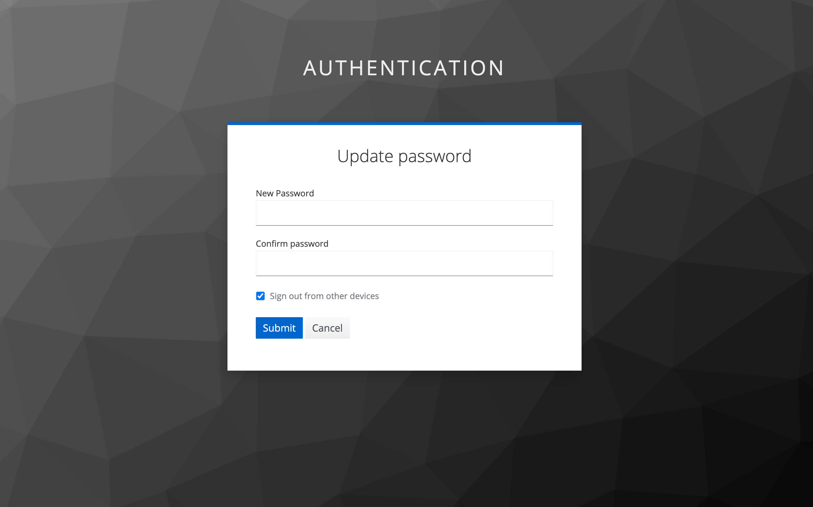

# CADDEテストベッド利用情報

CADDEテストベッドの利用開始にあたって、各参加者は以下の情報をCADDEテストベッド運用者（東京大学）から受け取る。

- CADDEユーザアカウント
  - CADDEユーザID
  - 初期パスワード
- CADDEアプリケーションのクライアント情報
  - クライアントID
  - クライアントシークレット
- CADDE支援サービスの情報
  - 認証機能
  - 横断検索機能
  - 来歴管理機能

これらのCADDEテストベッド利用情報を基に、テストベッド参加者はデータ利用者・データ提供者環境の構築および利用を行う。

## 1. CADDEユーザアカウント

CADDEユーザとは、CADDEユーザIDを用いて一意に識別される主体であり、CADDEを利用する個人または組織に対応する。
CADDEユーザはデータ利用者・データ提供者のいずれの役割も担うことができ、データ利用者環境・データ提供者環境はそれぞれCADDEユーザごとに構築される。

CADDEユーザIDは、データ利用者の認証や、データ取得のリクエスト先となるデータ提供者の識別などに用いられる。

<!-- omit in toc -->
### CADDEユーザアカウントの発行

CADDEテストベッドの利用開始時、各テストベッド参加者に対して、3つのCADDEユーザアカウント（ID・パスワード）が最初に発行される。
テストベッド参加者は3つのCADDEユーザアカウントを用いることで、自ら構築するデータ利用者環境・データ提供者環境において、CADDEを用いたデータ共有シナリオの検証をより柔軟に行うことが可能となる。

ただし、テストベッド参加者は必ずしも3つのユーザアカウントすべてを利用する必要はなく、各自のテストベッドの利用の仕方に応じてユーザを使い分ければよい。

また、テストベッドの利用にあたって3つ以上のCADDEユーザアカウントが必要となった場合には、別途CADDEテストベッド運用者（東京大学）に問い合わせること。

<!-- omit in toc -->
#### CADDEユーザIDの採番規則

CADDEテストベッドにおいて、CADDEユーザIDは以下の規則で採番される。

- **`<serial number（4桁）>-<sitename>`**
  - serial number
    - 各組織（site）ごとに連番で増加する4桁の値
  - sitename
    - テストベッドネットワーク用DNSのために割り当てられた各社の識別名
  - 例：`0001-koshizukalab`

<!-- omit in toc -->
### 初期パスワード変更手順

CADDEユーザアカウントの発行時には一時的な初期パスワードが割り当てられる。

そのため、CADDE認証機能のアカウントコンソールにアクセスし、パスワードを変更するようにする。
後述の通り、CADDE認証機能のアカウントコンソールURLは、CADDEユーザアカウントの発行と同時に支援サービスの情報として受け取る。

まず、最初に表示されるアカウントコンソール画面から`Signing in`を押下し、CADDEユーザの認証を行う。

ユーザ認証が完了すると、ユーザパスワードの`Update`ボタンが表示される。

新たなパスワードを2回入力すると、パスワードが更新される。

## 2. CADDEアプリケーションのクライアント情報

クライアントとは、CADDEが認可連携のプロトコルとして利用するOAuthという標準仕様において、保護されたリソースへのアクセスを要求するシステムとして定義される。

CADDEテストベッドにおけるクライアントは、CADDE認証機能を利用するアプリケーションを指し、クライアントIDによって識別される。
クライアントIDは、例えば認証トークンの発行・検証などの際に用いられる。

また、クライアントシークレットは、クライアントIDと合わせてCADDE認証機能を利用するアプリケーションの認証に用いられる。

<!-- omit in toc -->
### クライアント情報の発行

CADDEユーザアカウントの発行と同時に、以下のCADDEアプリケーションのクライアント情報（ID・シークレット）が発行される。

- データ提供者環境
  - 認可機能
- データ利用者環境
  - 利用者コネクタ
  - 利用者WebApp

データ利用者環境・データ提供者環境上にCADDEアプリケーションは、CADDEユーザごとに構築される。
そのため、上記のクライアント情報はテストベッド参加者が利用するCADDEユーザアカウントの数だけ発行されることとなる。

<!-- omit in toc -->
#### クライアントIDの採番規則

CADDEテストベッドにおいて、クライアントIDは以下の規則で採番される。

- **`<app name>-<CADDEユーザID>`**
  - app name
    - CADDEを構成するアプリケーション名（下表を参照）
  - CADDEユーザID
    - 当該アプリーションを構築・利用するCADDEユーザID
  - 例：`consumer-0001-koshizukalab`

| アプリケーション  | app name |
| --------- | -------- |
| 認可機能      | authz    |
| 利用者コネクタ   | consumer |
| 利用者WebApp | webapp   |

## 3. CADDE支援サービスの情報

CADDE支援サービスとは、CADDE運用者が管理し、CADDE参加者が共通で利用する機能のことである。

CADDEテストベッドの利用に際し、各参加者は以下のCADDE支援サービスに関する情報を受け取る。

- **認証機能**
  - ユーザアカウントコンソールのURL
  - 認証用CADDE APIのベースURL
  - 認証用Keycloak APIのベースURL
- **横断検索機能**
  - 横断検索サイトURL
  - 横断検索用APIのベースURL
- **来歴管理機能**
  - 来歴管理機能APIのベースURL
